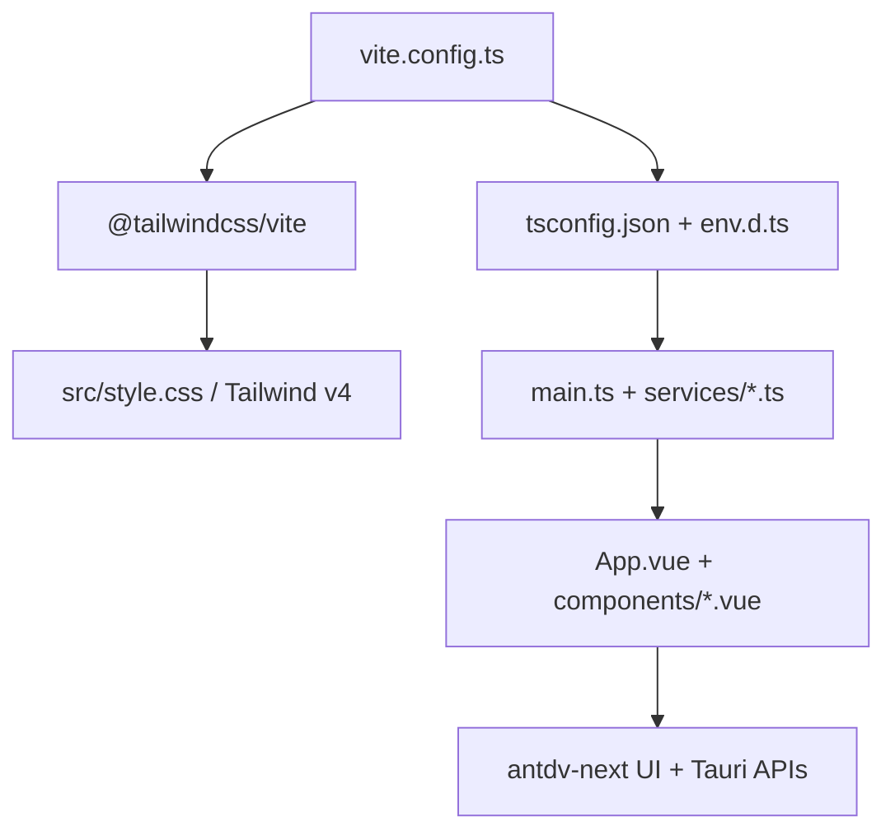

# 变更提案: tailwind4-ts-migration

## 元信息
```yaml
类型: 重构
方案类型: implementation
优先级: P1
状态: 已确认
创建: 2026-03-18
```

---

## 1. 需求

### 背景
当前项目前端已经完成 `antdv-next` 迁移，但仍以 `JavaScript` 为主，缺少统一的类型约束；同时样式体系主要依赖手写全局 CSS，缺少更高效的原子化样式能力。用户希望在不破坏现有桌面工作台布局和 Tauri 交互的前提下，接入 `Tailwind CSS v4`，并将前端整体升级到 `TypeScript`。

### 目标
- 在当前 `Vite 7 + Vue 3.5` 工程中接入并适配 `Tailwind CSS v4`
- 将前端入口、构建配置、服务层以及 `src` 下各 `Vue SFC` 脚本整体升级为 `TypeScript`
- 保留当前 `antdv-next` 主体界面结构和深浅主题体验
- 采用“混合重构”方式，将高频容器、按钮区、面板间距、状态标签等逐步迁移为 `Tailwind` 组合类

### 约束条件
```yaml
时间约束: 本轮内完成可构建、可验证的前端迁移
性能约束:
  - 不引入运行时 CSS-in-JS 或额外状态管理层
  - 保持 Tauri 前端启动与主要页面交互不因样式方案切换产生明显性能回退
兼容性约束:
  - 需兼容 Vue 3.5、Vite 7、Tauri 2、antdv-next 当前依赖版本
  - Tailwind 接入方式遵循官方 Vite 插件方案
  - TypeScript 方案需兼容 `.vue`、`@tauri-apps/api` 和现有 Monaco/xterm 依赖
业务约束:
  - 不改变 SSH、SFTP、终端、文件编辑、系统监控等核心功能流转
  - 保留现有深浅主题变量体系与桌面工作台布局
```

### 验收标准
- [ ] `tailwindcss` 与 `@tailwindcss/vite` 已接入，`vite.config.ts` 与主样式可正常构建
- [ ] 前端入口、服务层、Vite 配置和 `src` 下组件脚本完成 `JS -> TS` 升级
- [ ] `npm run build` 通过，且无残留旧 `*.js` 入口/服务脚本
- [ ] 高使用频率区域至少完成一轮 `Tailwind` 混合重构，现有布局与主题体验无结构性回退

---

## 2. 方案

### 技术方案
采用“底座先行，分层收口”的迁移策略：
1. 接入 `Tailwind CSS v4` 的官方 Vite 插件链，并建立 `tsconfig`、`env.d.ts`、`vue-tsc` 所需的类型底座。
2. 优先迁移 `main.js`、`vite.config.js` 和 `services/*.js`，建立共享类型、Tauri 调用参数和通用数据结构。
3. 分批将 `Vue SFC` 迁移到 `<script setup lang="ts">`，先处理应用壳层与中等复杂度组件，再处理超大组件。
4. 在不推翻现有全局主题变量的前提下，引入 `Tailwind` 工具类，优先改造高频容器、按钮区、间距系统和状态标签，使 `Tailwind` 与现有 `style.css` 协同工作。
5. 通过构建验证收口，并同步更新知识库与变更记录。

### 影响范围
```yaml
涉及模块:
  - app-shell: 入口文件、全局样式导入、主题与消息注册
  - build-config: Vite 配置、TypeScript 配置、环境声明
  - services: SSH、SFTP、主题服务的类型化与导出调整
  - ui-components: App 壳层、导航、终端、文件管理、监控、设置与 SSH 模态框
  - knowledge-base: 方案包、CHANGELOG、项目上下文同步
预计变更文件: 18-24
```

### 风险评估
| 风险 | 等级 | 应对 |
|------|------|------|
| 超大组件在一次性 TS 迁移中出现类型雪崩 | 高 | 先搭建共享类型与工具函数，再按批次迁移；对超大组件优先收紧关键类型而非一口气极限严格化 |
| Tailwind 与现有 `.ant-*` 覆盖样式产生层叠冲突 | 高 | 保留主题变量为底座，限制 Tailwind 首轮主要覆盖布局和状态类，避免直接重写组件库核心结构 |
| Tauri `invoke/listen` 调用缺少精确类型导致回归 | 中 | 为常用事件、连接信息、文件信息建立前端类型声明，并逐步约束服务层返回值 |
| 构建链从 JS 切到 TS 后暴露历史隐性问题 | 中 | 先让 `tsconfig` 保持稳妥可过渡，再结合 `npm run build` 分批修复类型和导入问题 |

---

## 3. 技术设计（可选）

> 本次不涉及 Rust 后端 API 变更，但前端构建链、类型层和样式组织方式会调整。

### 架构设计


### API设计
N/A

### 数据模型
| 字段 | 类型 | 说明 |
|------|------|------|
| `TabItem` | TypeScript interface | 标签页通用结构，覆盖本地终端、SSH、文件预览等类型 |
| `SshProfile` | TypeScript interface | SSH 配置与已保存连接数据结构 |
| `TerminalConfig` | TypeScript interface | 终端主题与行为配置结构 |
| `SftpFileEntry` | TypeScript interface | 远程文件列表项结构 |

---

## 4. 核心场景

> 执行完成后同步到对应模块文档

### 场景: 应用启动与样式加载
**模块**: app-shell
**条件**: 启动 Vite/Tauri 前端
**行为**: 入口加载 `Tailwind CSS v4`、注册 `antdv-next`，并以 TypeScript 方式挂载应用
**结果**: 前端可正常启动，Tailwind 工具类与现有主题变量同时生效

### 场景: SSH/文件管理工作流
**模块**: services + ui-components
**条件**: 用户打开连接、浏览远程文件、操作下载或编辑
**行为**: 服务层使用类型化数据返回连接信息、文件信息和事件回调，组件脚本通过 `lang="ts"` 使用这些结构
**结果**: 连接、文件浏览、下载和编辑能力保持原有行为，不因 TS 改造中断

### 场景: 工作台界面混合重构
**模块**: ui-components
**条件**: 用户使用顶部栏、左侧连接区、中央标签区、右侧监控区
**行为**: 高频布局容器、间距、标签和状态展示部分改用 Tailwind 类，保留现有 `antdv-next` 组件和主题变量
**结果**: 视觉更统一，样式维护成本下降，同时不出现明显结构性回退

---

## 5. 技术决策

> 本方案涉及的技术决策，归档后成为决策的唯一完整记录

### tailwind4-ts-migration#D001: 采用“底座先行，分层收口”的迁移路径
**日期**: 2026-03-18
**状态**: ✅采纳
**背景**: 本次任务同时涉及 `Tailwind 4` 接入、前端全量 `TS` 迁移以及大体量组件改造。若按功能区混合推进，容易在多个批次里重复调整类型、构建和样式底座。
**选项分析**:
| 选项 | 优点 | 缺点 |
|------|------|------|
| A: 底座先行，分层收口 | 先稳定构建链与类型底座，风险集中，可逐批验证 | 中间阶段会出现新旧样式共存 |
| B: 按功能模块纵切 | 单个业务区完成度更高，用户更早看到局部收益 | 容易多次回头调整公共配置和共享类型 |
**决策**: 选择方案A
**理由**: 该项目已存在多个超大组件，优先稳定 `Tailwind + TypeScript` 底座更能控制风险，并减少跨模块返工。
**影响**: 影响 `vite.config.*`、`tsconfig*`、`src/main.*`、`src/services/*`、`src/components/*` 与 `src/style.css`

### tailwind4-ts-migration#D002: 采用 Tailwind 混合重构而非整站重画
**日期**: 2026-03-18
**状态**: ✅采纳
**背景**: 用户明确要求接入 `Tailwind 4`，同时选择“混合重构”，并希望保留当前桌面工具界面的总体结构与使用手感。
**选项分析**:
| 选项 | 优点 | 缺点 |
|------|------|------|
| A: 混合重构 | 兼容现有主题与交互，风险更低 | 首轮样式体系会并存 |
| B: 全量重画为 Tailwind 风格 | 一致性更强 | 成本高，回归风险大，不符合本轮目标 |
**决策**: 选择方案A
**理由**: 当前项目大量依赖现有主题变量和组件库结构，更适合逐步将布局、状态和容器样式迁移到 Tailwind。
**影响**: 主要影响 `src/style.css`、`App.vue`、`TopMenu.vue`、`Sidebar.vue`、`RightPanel.vue` 等高频界面文件

---

## 6. 成果设计

### 设计方向
- **美学基调**: 保持当前“桌面工作台”质感，在不改变信息密度的前提下，用更清晰的层次、间距与状态色组织界面
- **记忆点**: 左中右三栏工作台与顶部工具带的紧凑专业感
- **参考**: 以当前项目运行态为准，不引入与现有产品气质冲突的新视觉语言

### 视觉要素
- **配色**: 延续现有蓝色主强调、浅色工作台与深色终端双主题，通过 Tailwind 工具类辅助统一间距、边框和状态色
- **字体**: 保持当前 `"SF Pro Display", "PingFang SC", "Segoe UI Variable", "Microsoft YaHei", sans-serif` 字体栈，避免本轮引入新字体变量
- **布局**: 保持顶部栏、左侧连接管理、中间标签工作区、右侧监控下载面板的三栏布局
- **动效**: 维持现有轻量交互反馈，不新增重动画；重点保证切换和悬停反馈的一致性
- **氛围**: 延续当前半透明面板、柔和边框、渐变背景与终端工作台纵深感

### 技术约束
- **可访问性**: 保持表单、按钮、菜单和标签区的语义结构，确保主题切换后仍具备足够对比度
- **响应式**: 以桌面窗口布局为主，保留现有折叠侧栏和弹性面板行为
