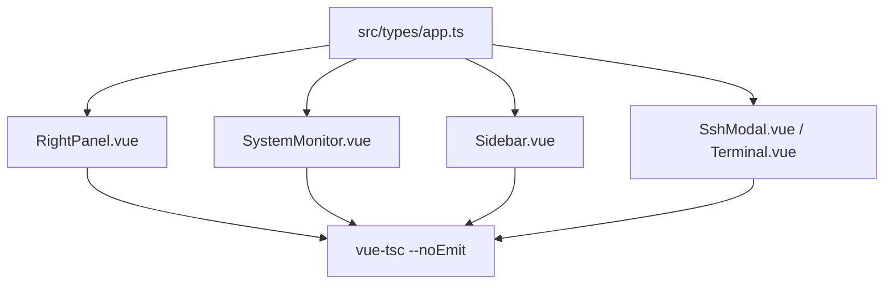

# 变更提案: ts-typecheck-closure

## 元信息
```yaml
类型: 优化
方案类型: implementation
优先级: P1
状态: 已确认
创建: 2026-03-18
```

---

## 1. 需求

### 背景
第一轮已经完成 `Tailwind CSS v4` 接入和前端整体 `JS -> TS` 迁移，且 `npm run build` 可通过，但 `vue-tsc --noEmit` 仍在多个大组件中报告大量类型错误。为让 TypeScript 迁移真正闭环，需要补齐共享数据模型、事件载荷、DOM 引用与 Tauri 调用返回值类型，并移除过渡期留下的类型噪音。

### 目标
- 以 `vue-tsc --noEmit` 通过为明确验收目标，完成第二轮类型收口
- 优先修复 `Sidebar`、`RightPanel`、`SystemMonitor` 三个超大组件中的核心类型链路
- 补齐 `DownloadManager`、`FileEditor`、`FileManager`、`SettingsModal`、`SshModal`、`Terminal` 等剩余组件的边缘类型问题
- 保持当前 `Tailwind + antdv-next + Tauri` 的运行和构建状态不回退

### 约束条件
```yaml
时间约束: 在本轮内完成类型闭环与验证
性能约束:
  - 不引入新的运行时依赖，仅通过类型声明和局部代码调整完成收口
  - 不改变已建立的构建产物拆分策略和现有运行时行为
兼容性约束:
  - 保持 Vue 3.5、Vite 7、Tauri 2 与 Tailwind CSS 4 现有集成方式
  - 保持 `npm run build` 继续通过
业务约束:
  - 不改变 SSH、SFTP、终端、下载、系统监控等功能流转
  - 优先收敛类型问题，避免顺手改动无关 UI 逻辑
```

### 验收标准
- [ ] `vue-tsc --noEmit` 通过
- [ ] `npm run build` 继续通过
- [ ] 第二轮中不再依赖过渡性兜底来绕过类型问题，核心超大组件具备可持续维护的明确类型结构

---

## 2. 方案

### 技术方案
本轮采用“先模型，后组件；先数据面，后交互面”的收口路径：
1. 扩展共享类型文件，补齐系统监控数据、下载进度、侧边栏配置项、Tauri 事件载荷等接口。
2. 在 `RightPanel` 与 `SystemMonitor` 中统一系统监控数据结构，修复批量接口返回值和模板字段访问类型。
3. 在 `Sidebar`、`SshModal`、`Terminal` 中修复列表项、弹窗 slot、DOM 输入节点和终端选项类型。
4. 收尾 `DownloadManager`、`FileEditor`、`FileManager`、`SettingsModal` 等边缘报错，最终以 `vue-tsc` 和 `build` 双通过验收。

### 影响范围
```yaml
涉及模块:
  - src/types/app.ts: 新增系统监控、下载、文件管理相关共享类型
  - src/components/RightPanel.vue: 监控/下载双标签的数据结构和事件类型
  - src/components/SystemMonitor.vue: 批量系统信息结构与展示字段类型
  - src/components/Sidebar.vue: 连接配置列表、SFTP 文件项、Modal 输入节点与弹窗渲染类型
  - src/components/SshModal.vue, Terminal.vue: 表单数据与终端事件类型
  - 其余边缘组件: 消除剩余 unknown / {} / DOM 事件类型错误
预计变更文件: 8-12
```

### 风险评估
| 风险 | 等级 | 应对 |
|------|------|------|
| 超大组件内部状态多、分支多，修类型时容易误伤现有逻辑 | 高 | 先抽共享接口，再按报错热点逐段修复，不做无关重构 |
| Tauri 返回值结构与前端假设不一致，可能出现类型与运行时脱节 | 中 | 以现有运行逻辑为基准补接口，必要时通过调用点收窄类型而不是盲目放宽 |
| antdv-next 的 slot/render API 类型较严格，弹窗和自定义内容容易报错 | 中 | 用 `h()` 或明确的 DOM 断言修正，而非继续保留隐式 any |

---

## 3. 技术设计（可选）

> 本轮不涉及后端 API 变更，重点是前端共享类型和组件内部状态模型收口。

### 架构设计


### API设计
N/A

### 数据模型
| 字段 | 类型 | 说明 |
|------|------|------|
| `SystemInfoBatch` | interface | 系统监控批量接口返回结构，包含 `system/cpu/memory/disk/network/process` |
| `DownloadProgressPayload` | interface | 下载事件的载荷结构，包含 `downloadId/downloaded/total/progress` |
| `SidebarProfileItem` | type alias | 侧边栏连接项的展示与分组结构 |
| `SftpState` | interface | 当前连接下的 SFTP 视图状态，包含路径、文件列表、历史和 loading 状态 |

---

## 4. 核心场景

> 执行完成后同步到对应模块文档

### 场景: 系统监控与下载面板类型闭环
**模块**: `RightPanel` / `SystemMonitor`
**条件**: 用户切换到监控或下载区域
**行为**: 批量系统信息和下载进度事件均以明确类型接入模板与脚本
**结果**: 模板字段访问不再依赖 `{}` 或 `unknown`

### 场景: 连接管理与 SFTP 列表类型闭环
**模块**: `Sidebar` / `SshModal`
**条件**: 用户浏览连接列表、编辑 SSH 配置、管理 SFTP 文件
**行为**: 配置项、分组结果、弹窗内容与 DOM 输入节点均使用清晰类型定义
**结果**: `Sidebar` 相关模板与事件类型错误清零

### 场景: 终端与边缘组件类型闭环
**模块**: `Terminal` / 其余边缘组件
**条件**: 用户使用终端、编辑器、下载管理和文件管理
**行为**: 终端选项、事件 payload 和返回值断言收口到可维护状态
**结果**: `vue-tsc --noEmit` 通过且运行行为保持不变

---

## 5. 技术决策

> 本方案涉及的技术决策，归档后成为决策的唯一完整记录

### ts-typecheck-closure#D001: 以共享类型驱动第二轮收口
**日期**: 2026-03-18
**状态**: ✅采纳
**背景**: 当前报错大量集中在 `unknown`、`{}` 和事件/接口返回值未建模，若直接在各组件零散加断言，后续维护成本仍高。
**选项分析**:
| 选项 | 优点 | 缺点 |
|------|------|------|
| A: 先扩展共享类型，再修组件 | 类型来源集中，后续维护稳定 | 需要先梳理多处数据结构 |
| B: 在组件中直接加局部断言 | 动手快 | 容易形成更多分散且不可复用的类型碎片 |
**决策**: 选择方案A
**理由**: 第二轮目标是类型验收闭环，必须让核心数据结构可复用，而不是只把报错暂时压下去。
**影响**: 影响 `src/types/app.ts` 与所有存在模板字段访问错误的组件

### ts-typecheck-closure#D002: 保持运行时逻辑稳定，优先修类型而非重构交互
**日期**: 2026-03-18
**状态**: ✅采纳
**背景**: 第一轮刚完成构建可用状态，第二轮如果夹带大量交互重构，会显著提升回归风险。
**选项分析**:
| 选项 | 优点 | 缺点 |
|------|------|------|
| A: 以类型修复为主 | 回归面小，目标明确 | 代码结构未必最理想 |
| B: 顺手做大重构 | 结构可能更漂亮 | 容易扩大范围、拖慢收口 |
**决策**: 选择方案A
**理由**: 当前最重要的是让 TypeScript 迁移真正完成闭环，并守住已通过的构建结果。
**影响**: 约束本轮所有组件修改都以收敛类型问题为主

---

## 6. 成果设计

N/A
