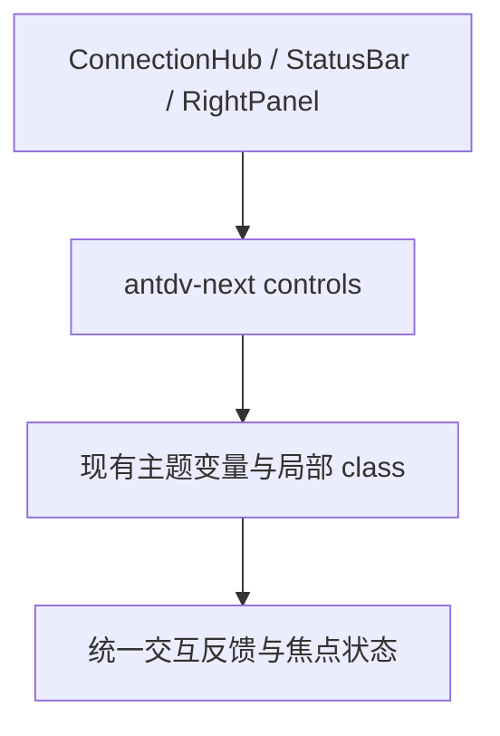

# 变更提案: frontend-antdv-unification

## 元信息
```yaml
类型: 优化
方案类型: implementation
优先级: P1
状态: 已确认
创建: 2026-03-19
```

---

## 1. 需求

### 背景
项目已经完成 `antdv-next` 整库迁移，但前端仍残留少量原生按钮、筛选 pill 和卡片式入口，导致交互反馈、焦点状态和样式体系不完全统一。用户希望先做一轮整体 review，并把“高价值、低风险”的原生控件优先替换成 `antdv-next` 实现。

### 目标
- 对当前前端组件做一轮面向一致性与可维护性的 review
- 将高价值遗留原生控件统一到 `antdv-next` 组件体系
- 保留性能敏感或平台能力驱动的原生实现，避免为了统一而引入回归

### 约束条件
```yaml
时间约束: 本轮内完成高价值组件统一、构建验证和知识库同步
性能约束:
  - 不改动终端、编辑器、文件上传等性能敏感路径的核心实现
  - 不引入额外状态层或无关重构
兼容性约束:
  - 保持 Vue 3.5、Vite 7、Tauri 2 与现有主题变量体系兼容
  - 复用项目当前已注册的 antdv-next 能力，不新增替代 UI 库
业务约束:
  - 只处理高价值遗留控件，不做整页重绘
  - 保持连接中心、状态栏、右侧传输面板的现有信息密度与交互节奏
```

### 验收标准
- [ ] 状态栏、连接中心和右侧传输筛选中的高价值原生控件改为 `antdv-next` 组件
- [ ] 原生 `textarea`、隐藏文件输入等性能或平台敏感实现保留，并在 review 中说明原因
- [ ] `pnpm run build` 通过
- [ ] 知识库与变更记录同步到本次改造结果

---

## 2. 方案

### 技术方案
采用“局部统一、保留热路径”的策略推进：
1. 使用 `a-button`、`a-segmented`、`a-card`、`a-tag` 等组件替换状态栏、连接中心和右侧传输面板中的原生按钮与筛选控件。
2. 保留 `FileEditor.vue` 中的大文本编辑 `textarea`，以及隐藏文件上传 `input`，避免影响输入性能、原生文件选择能力和现有行为。
3. 在样式层仅做必要的类名和状态样式收口，延续现有工作台视觉，不额外引入新的视觉方向。
4. 结合 review 输出记录未纳入本轮的遗留点与后续建议。

### 影响范围
```yaml
涉及模块:
  - connection-hub: 分组筛选、连接卡片和标签表现统一到 antdv-next
  - status-bar: 操作按钮统一为 antdv-next 文本按钮
  - right-panel: 传输筛选按钮统一为 antdv-next segmented
  - top-menu: 代码 review 结论中记录其当前未接入主流程的状态
预计变更文件: 5-8
```

### 风险评估
| 风险 | 等级 | 应对 |
|------|------|------|
| `a-card` / `a-segmented` 替换后间距和焦点态与现有工作台不一致 | 中 | 保留现有主题变量和核心类名，仅替换交互骨架 |
| 连接卡片点击区域和 active 状态语义变化 | 中 | 使用整卡点击写法并保留激活态 class |
| 误把性能敏感原生控件一并替换，导致编辑/上传行为回归 | 高 | 将 `textarea` 与隐藏文件输入明确排除在本轮外 |

---

## 3. 技术设计（可选）

> 本次不涉及后端接口和数据模型变更，重点是前端交互骨架统一。

### 架构设计


### API设计
N/A

### 数据模型
N/A

---

## 4. 核心场景

> 执行完成后同步到对应模块文档

### 场景: 连接中心筛选与启动
**模块**: connection-hub
**条件**: 用户进入连接中心并按分组或关键词筛选连接
**行为**: 使用 `a-segmented` 切换分组，用 `a-card` 呈现连接卡片与标签信息
**结果**: 视觉和交互与项目中其他 `antdv-next` 区域保持一致

### 场景: 状态栏快捷操作
**模块**: status-bar
**条件**: 用户在底部状态栏切换监控/下载面板或打开设置
**行为**: 使用 `a-button` 文本按钮承载图标操作，保留激活态
**结果**: 焦点态、hover 反馈和禁用语义更统一

### 场景: 传输筛选
**模块**: right-panel
**条件**: 用户在右侧传输管理中筛选下载、上传、运行中、完成或失败任务
**行为**: 使用 `a-segmented` 统一筛选切换
**结果**: 多状态切换的可读性和一致性更高

---

## 5. 技术决策

> 本方案涉及的技术决策，归档后成为决策的唯一完整记录

### frontend-antdv-unification#D001: 保留性能敏感原生控件，只统一高价值交互壳层
**日期**: 2026-03-19
**状态**: ✅采纳
**背景**: 项目里仍有原生 `button`、`textarea`、隐藏文件输入等实现，但它们的性质并不相同。用户要求优先做高价值统一，而不是为了“全都换掉”牺牲交互稳定性。
**选项分析**:
| 选项 | 优点 | 缺点 |
|------|------|------|
| A: 优先替换高价值可见控件 | 收益集中，风险可控，能明显提升一致性 | 仍会保留少量原生实现 |
| B: 追求全部替换 | 表面上更“统一” | 容易误伤编辑器、文件选择等热路径行为 |
**决策**: 选择方案 A
**理由**: 当前项目是桌面终端工具，编辑与文件操作路径的稳定性比表面统一更重要，因此本轮只统一那些能显著提升体验、且不触碰热路径的控件。
**影响**: 影响 `ConnectionHub.vue`、`StatusBar.vue`、`RightPanel.vue`，并在 review 中记录 `TopMenu.vue` 的遗留状态

---

## 6. 成果设计

> 含视觉产出的任务由 DESIGN Phase2 填充。非视觉任务整节标注"N/A"。

### 设计方向
- **美学基调**: 工业实用型工作台，在现有半透明面板和紧凑布局基础上，强化工具级组件的一致反馈
- **记忆点**: 连接中心的筛选条和连接卡片都采用统一的 antdv-next 交互骨架，但保留原有高密度信息布局
- **参考**: 以当前项目现有工作台视觉为准，不引入新设计体系

### 视觉要素
- **配色**: 延续主题变量，主强调色仍为现有蓝色系，激活态与 hover 态统一走组件状态色
- **字体**: 保持项目当前桌面应用字体体系，本轮不额外切换字体
- **布局**: 保持原有信息密度和栅格结构，只更换控件骨架
- **动效**: 以组件自带反馈和现有轻量 hover 态为主，不额外新增动画
- **氛围**: 保留现有玻璃感浅面板与深色终端背景的对比关系

### 技术约束
- **可访问性**: 保留按钮语义和焦点态，避免用纯 `div` 承担交互
- **响应式**: 保持现有 860px 附近的换行逻辑，不新增复杂断点
