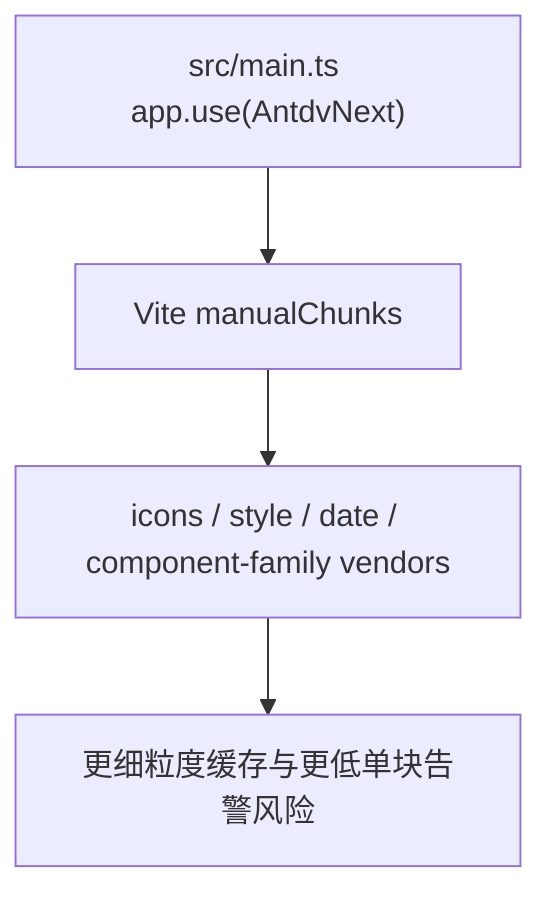

# 变更提案: bundle-chunk-optimization

## 元信息
```yaml
类型: 优化
方案类型: implementation
优先级: P1
状态: 已确认
创建: 2026-03-19
```

---

## 1. 需求

### 背景
当前构建已经做了基础 `manualChunks`，但 `antdv-next` 相关依赖仍被统一打进单个 `antdv-vendor`，构建产物约 1.9 MB，持续触发大 chunk 警告。用户希望先走低风险路径，优先通过分包策略降低 vendor 集中度，而不是直接切换到按需注册。

### 目标
- 将 `antdv-next` 单一大 vendor chunk 拆成多组更细的稳定 chunk
- 保持当前全量注册方式不变，避免影响组件运行行为
- 用最小改动压低大 chunk 警告并改善缓存粒度

### 约束条件
```yaml
时间约束: 本轮内完成分包策略调整、构建验证和知识库同步
性能约束:
  - 不改动运行时组件逻辑，不引入新的分析依赖
  - 允许增加少量 vendor 请求数，但避免过度碎片化
兼容性约束:
  - 保持 Vue 3.5、Vite 7、Tauri 2 兼容
  - 保持 `main.ts` 中 `app.use(AntdvNext)` 全量注册模式不变
业务约束:
  - 只做低风险构建层优化，不改 UI 交互
  - 不通过单纯调高 `chunkSizeWarningLimit` 掩盖问题
```

### 验收标准
- [ ] `vite.config.ts` 中的 `manualChunks` 能把 `antdv-next` 相关依赖拆成多组 vendor chunk
- [ ] `pnpm run build` 通过，且不再只有单个 `antdv-vendor` 超大 chunk
- [ ] `pnpm exec vue-tsc --noEmit` 通过
- [ ] 知识库与变更记录同步到本轮优化结果

---

## 2. 方案

### 技术方案
保留现有 `manualChunks` 主体逻辑，只对 `antdv-next` 依赖做更细分组：
1. 将 `@antdv-next/icons` 单独切为图标 chunk。
2. 将 `@antdv-next/cssinjs`、`antdv-next/dist/style`、`theme`、`config-provider` 等基础样式能力切为样式基础 chunk。
3. 将 `date-picker`、`time-picker`、`calendar`、`locale`、`dayjs` 等日期链路切为日期 chunk。
4. 其余 `antdv-next` 组件按交互/展示家族拆为 2-3 个稳定 chunk，避免继续挤成单块。

### 影响范围
```yaml
涉及模块:
  - build-config: 调整 Rollup manualChunks 分组规则
  - knowledge-base: 记录新的构建优化策略和结果
预计变更文件: 4-6
```

### 风险评估
| 风险 | 等级 | 应对 |
|------|------|------|
| vendor chunk 分得过细，增加首屏请求碎片 | 中 | 只按大模块家族拆分，避免“一组件一 chunk” |
| `antdv-next` 依赖链包含 `rc-*` / `dayjs` 等外围包，落入不合适分组 | 中 | 先按主依赖路径分组，再结合构建结果微调 |
| 通过分包减少告警但不减少总加载量 | 低 | 在方案中明确这是低风险缓存优化，不承诺替代按需注册收益 |

---

## 3. 技术设计（可选）

> 本次不涉及业务 API 或数据模型，仅调整构建输出策略。

### 架构设计


### API设计
N/A

### 数据模型
N/A

---

## 4. 核心场景

> 执行完成后同步到对应模块文档

### 场景: 生产构建输出
**模块**: build-config
**条件**: 执行 `pnpm run build`
**行为**: Rollup 根据新的 `manualChunks` 规则将 `antdv-next` 相关依赖切分到多组 vendor chunk
**结果**: 不再只有单个超大的 `antdv-vendor`，浏览器缓存粒度更细

### 场景: 运行时行为保持
**模块**: app-shell
**条件**: 应用正常启动并渲染已有组件
**行为**: 组件仍然通过现有全量注册和模板写法工作
**结果**: 构建策略优化不影响现有 UI 行为

---

## 5. 技术决策

> 本方案涉及的技术决策，归档后成为决策的唯一完整记录

### bundle-chunk-optimization#D001: 先做基于模块家族的 `manualChunks` 细分，不直接切按需注册
**日期**: 2026-03-19
**状态**: ✅采纳
**背景**: 当前 `antdv-next` 全量注册仍然保留，直接切按需注册会影响入口和组件接入方式；用户本轮明确选择低风险分包优化。
**选项分析**:
| 选项 | 优点 | 缺点 |
|------|------|------|
| A: 细分 `manualChunks`（按模块家族） | 改动小、回归风险低、能立即改善 chunk 集中度 | 总加载量下降有限 |
| B: 直接切按需注册 | 理论收益更大 | 需要改入口与组件接入，回归面更大 |
**决策**: 选择方案 A
**理由**: 本轮目标是“低风险先收口”，因此先通过构建层细分 chunk 改善 vendor 集中度；后续如仍不满意，再进入按需注册阶段。
**影响**: 影响 `vite.config.ts`、构建产物命名和知识库中的构建优化描述

---

## 6. 成果设计

N/A

### 技术约束
- **可访问性**: N/A
- **响应式**: N/A
