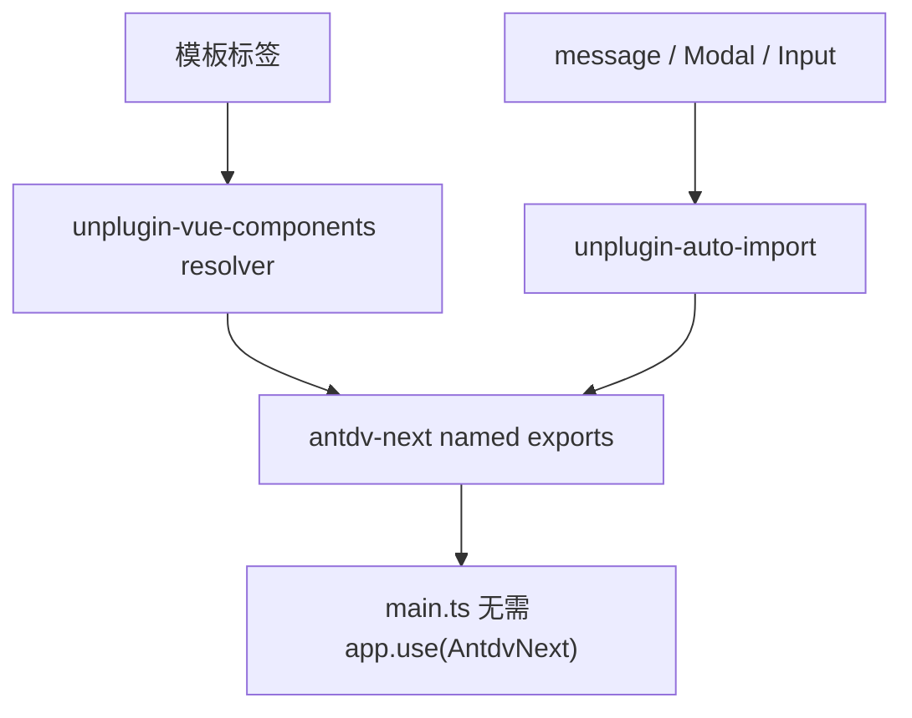

# 变更提案: antdv-auto-import

## 元信息
```yaml
类型: 优化
方案类型: implementation
优先级: P1
状态: 已确认
创建: 2026-03-19
```

---

## 1. 需求

### 背景
前一轮仅通过 `manualChunks` 细分了 `antdv-next` vendor，但项目入口仍保留 `app.use(AntdvNext)` 全量注册，导致总体依赖牵连依旧偏重。用户明确希望长期走自动按需注册方案，用插件替代手工逐组件维护。

### 目标
- 引入自动组件解析和脚本 API 自动导入插件
- 移除 `main.ts` 中的 `app.use(AntdvNext)` 全量注册
- 保持现有模板写法不变，降低后续新增组件的接入维护成本
- 在构建通过的前提下继续压低 `antdv-next` 相关产物规模与耦合

### 约束条件
```yaml
时间约束: 本轮内完成插件接入、入口切换、导入清理与构建验证
性能约束:
  - 优先减少不必要的全量依赖牵连
  - 不为了自动导入引入运行时逻辑层
兼容性约束:
  - 保持 Vue 3.5、Vite 7、Tauri 2 兼容
  - 保持现有 `<a-*>` 模板写法与 `message / Modal / Input` 脚本调用可用
业务约束:
  - 不改现有组件业务逻辑
  - 保留 `antdv-next/dist/reset.css` 作为全局样式基线
```

### 验收标准
- [ ] 已引入自动组件解析与自动导入插件，并生成声明文件
- [ ] `src/main.ts` 不再使用 `app.use(AntdvNext)`
- [ ] 项目中 `message / Modal / Input` 的显式 `antdv-next` 导入已清理为插件自动导入
- [ ] `pnpm run build` 与 `pnpm exec vue-tsc --noEmit` 通过
- [ ] `antdv-next` 相关产物较上一轮继续下降，且构建中不再出现此前的 circular chunk 提示

---

## 2. 方案

### 技术方案
采用“插件自动导入 + 保留现有模板”的方式推进：
1. 使用 `unplugin-vue-components` 为当前项目写一个 `antdv-next` 自定义 resolver，将 `<a-button>` 这类模板标签自动映射到对应的命名导出。
2. 使用 `unplugin-auto-import` 自动注入 `message`、`Modal`、`Input` 等脚本侧 API。
3. 移除入口的全量 `app.use(AntdvNext)`，保留 `reset.css`。
4. 保留前一轮 `manualChunks` 细分策略，观察自动按需后构建产物的进一步变化。

### 影响范围
```yaml
涉及模块:
  - app-shell: 入口注册方式、Vite 插件配置、自动生成声明文件
  - ui-components: 清理脚本中的 `message / Modal / Input` 手工导入
  - docs: 更新前端模块说明与知识库状态
预计变更文件: 12-18
```

### 风险评估
| 风险 | 等级 | 应对 |
|------|------|------|
| 自定义 resolver 映射错误，导致模板组件解析失败 | 高 | 仅覆盖当前项目实际用到的 `a-*` 组件命名模式，并通过构建与类型检查验证 |
| 自动导入影响脚本作用域，出现未预期的全局标识符 | 中 | 自动导入范围只收敛到 `Input`、`Modal`、`message` 三项 |
| 插件接入后构建虽通过，但产物收益不明显 | 中 | 保留上一轮 `manualChunks` 并对比产物尺寸，确认是否继续收益 |

---

## 3. 技术设计（可选）

> 本次不涉及业务 API 或数据模型，仅调整前端组件注册与构建接入方式。

### 架构设计


### API设计
N/A

### 数据模型
N/A

---

## 4. 核心场景

> 执行完成后同步到对应模块文档

### 场景: 模板组件解析
**模块**: app-shell
**条件**: 构建 Vue SFC 模板
**行为**: `unplugin-vue-components` 自动将 `<a-*>` 标签映射到 `antdv-next` 命名导出
**结果**: 无需在入口全量注册组件，也无需在单文件中手工导入模板组件

### 场景: 脚本 API 调用
**模块**: ui-components
**条件**: 组件或服务中调用 `message`、`Modal` 或 `Input`
**行为**: `unplugin-auto-import` 自动注入脚本依赖
**结果**: 保持原有调用方式，但减少重复 import 与全量入口依赖

---

## 5. 技术决策

> 本方案涉及的技术决策，归档后成为决策的唯一完整记录

### antdv-auto-import#D001: 采用插件自动按需注册，而不是继续手工维护入口注册清单
**日期**: 2026-03-19
**状态**: ✅采纳
**背景**: 用户明确判断长期看自动插件方案更适合仓库演进，且项目当前已广泛使用 `<a-*>` 模板标签与 `message / Modal` API。
**选项分析**:
| 选项 | 优点 | 缺点 |
|------|------|------|
| A: 纯手工按需注册 | 无新增插件依赖，可完全显式控制 | 维护成本高，新增组件时容易漏注册 |
| B: 插件自动按需注册 | 长期维护成本低，新增组件接入更顺滑 | 需要增加构建插件并维护 resolver |
**决策**: 选择方案 B
**理由**: 当前项目组件面已较大，继续手工维护注册清单会逐步抵消按需注册的长期收益；插件方案更符合仓库长期演进方向。
**影响**: 影响 `vite.config.ts`、`src/main.ts`、多处组件脚本 import 与自动生成的声明文件

---

## 6. 成果设计

N/A

### 技术约束
- **可访问性**: N/A
- **响应式**: N/A
