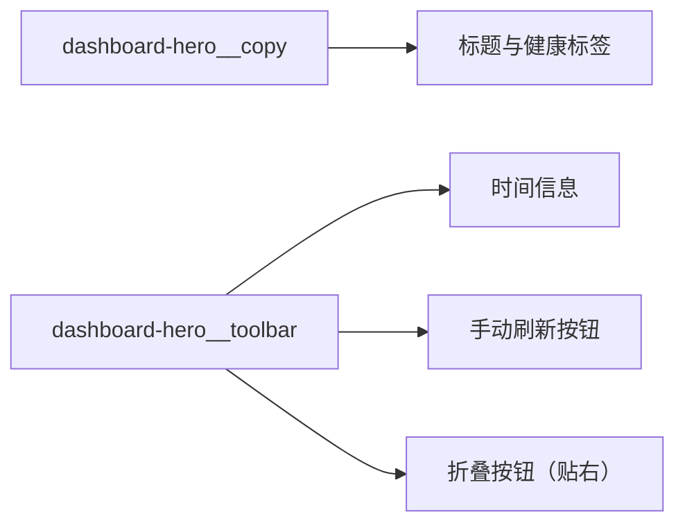

# 变更提案: monitor-collapse-button-edge

## 元信息
```yaml
类型: 优化
方案类型: implementation
优先级: P2
状态: 已确认
创建: 2026-03-20
```

---

## 1. 需求

### 背景
当前嵌入式系统监控首屏里，监控面板的折叠/返回按钮被放在主机名标题行内部，视觉上夹在标题和健康标签之间。按钮位置偏中，既会打断标题信息流，也不符合“面板操作控件贴边放置”的常见认知。

### 目标
- 将监控面板折叠按钮移动到卡片头部最右侧，贴近卡片右边缘
- 保持现有折叠交互和图标方向逻辑不变
- 不影响标题、健康状态标签、刷新按钮和时间信息的布局稳定性

### 约束条件
```yaml
时间约束: 本轮内完成单点修正
性能约束: 仅允许模板和样式微调，不新增运行时状态或额外渲染开销
兼容性约束: 继续兼容嵌入式监控面板的左右 placement 图标逻辑
业务约束: 不改监控数据刷新链路，不改 SshWorkspace 的结构关系
```

### 验收标准
- [ ] 监控折叠按钮不再位于标题和健康标签之间
- [ ] 折叠按钮位于卡片头部最右侧，并与头部区域垂直对齐
- [ ] `RightPanel` 的标题、状态标签、时间和手动刷新按钮布局仍然正常
- [ ] `pnpm run build` 可通过

---

## 2. 方案

### 技术方案
在 `src/components/RightPanel.vue` 中重排监控头部结构，将折叠按钮从 `dashboard-hero__title-row` 中移出，并放入 `dashboard-hero__toolbar` 的独立操作区。同步补充头部工具区的横向布局样式，让刷新按钮与折叠按钮共同靠右排列，形成“信息在左、操作在右”的稳定结构。

### 影响范围
```yaml
涉及模块:
  - ui-components: 调整 RightPanel 监控头部模板与样式
  - knowledge-base: 同步 ui-components 模块说明与 CHANGELOG
预计变更文件: 4
```

### 风险评估
| 风险 | 等级 | 应对 |
|------|------|------|
| 头部工具区宽度不足时发生换行 | 低 | 让时间区独占一行，操作按钮单独成组右对齐 |
| 按钮移位后影响 `placement` 图标语义 | 低 | 保留原有 `LeftOutlined/RightOutlined` 判定逻辑，不改事件 |

---

## 3. 技术设计

### 架构设计


---

## 4. 核心场景

> 执行完成后同步到对应模块文档

### 场景: 监控头部操作区
**模块**: ui-components
**条件**: 用户打开 SSH 工作区左侧嵌入式系统监控
**行为**: 标题和健康信息展示在左侧，刷新与折叠操作集中在右侧边缘
**结果**: 标题阅读路径更顺，面板级操作位置更符合直觉

---

## 5. 技术决策

> 本方案涉及的技术决策，归档后成为决策的唯一完整记录

### monitor-collapse-button-edge#D001: 将折叠按钮移入头部右侧工具区
**日期**: 2026-03-20
**状态**: ✅采纳
**背景**: 用户已明确要求“返回按钮放到边上”，并选择将按钮放到卡片头部最右侧。
**选项分析**:
| 选项 | 优点 | 缺点 |
|------|------|------|
| A: 挂到头部工具区最右侧 | 信息层级清晰，最符合“贴边”预期，改动集中 | 需要微调工具区布局 |
| B: 仍保留在标题行内，仅右移 | 改动更少 | 视觉上仍会干扰标题阅读流 |
**决策**: 选择方案 A
**理由**: 这是满足用户要求最直接、风险最低、语义也最清晰的方式。按钮作为面板级操作，放在头部右侧工具区比放在标题内部更自然。
**影响**: 仅影响 `RightPanel.vue` 的监控头部模板和对应样式

---

## 6. 成果设计

> 含视觉产出的任务由 DESIGN Phase2 填充。非视觉任务整节标注"N/A"。

### 设计方向
- **美学基调**: 延续当前轻量云控制台风格，不增加新视觉语言，只修正操作布局秩序
- **记忆点**: 标题信息完整靠左，操作控件整体靠右，首屏结构更利落
- **参考**: 当前监控仪表盘样式基线

### 视觉要素
- **配色**: 保持现有蓝白仪表盘配色，不新增颜色层级
- **字体**: 保持组件既有字体栈，避免这次单点修正引入无关变更
- **布局**: 头部采用左侧信息块 + 右侧操作块，两列职责明确
- **动效**: 保持现有按钮 hover/transition
- **氛围**: 保持现有卡片阴影和浅色玻璃感背景

### 技术约束
- **可访问性**: 保留现有按钮语义和点击区域
- **响应式**: 窄宽度下允许工具区自然换行，但折叠按钮仍保持右对齐
