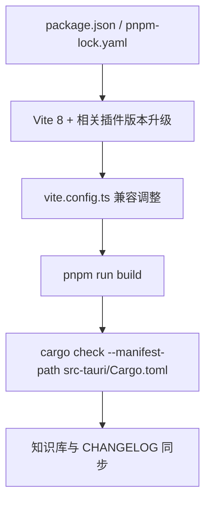

# 变更提案: vite8-upgrade

## 元信息
```yaml
类型: 优化
方案类型: implementation
优先级: P1
状态: 已确认
创建: 2026-03-20
```

---

## 1. 需求

### 背景
项目当前前端构建链停留在 `Vite 7.1.2`，而知识库、构建脚本和现有优化记录都已经围绕 `pnpm + Vue 3.5 + Tauri 2` 稳定下来。用户本轮希望把项目升级到 `Vite 8`，同时要求走“全链路升级”路径，不只修改依赖版本，还要补齐直接相关插件版本、检查 `vite.config.ts` 中现有 `manualChunks` 与依赖预构建策略，并完成前端与桌面侧验证，避免升级后在 `Tauri dev/build` 链路里留下隐藏回归。

### 目标
- 将前端构建核心升级到 `Vite 8`
- 保持当前 Vue 3、Tailwind 4、`unplugin-*`、`monaco-editor` 和 Tauri 2 工作流继续可用
- 保留现有 `vite.config.ts` 的分包优化收益，并在必要时做兼容调整
- 用实际构建与桌面侧校验确认升级结果可交付

### 约束条件
```yaml
时间约束: 本轮内完成依赖升级、配置兼容、前端构建验证、桌面侧校验与知识库同步
性能约束:
  - 不回退现有 `manualChunks` 带来的 vendor 分包收益
  - 不为了消除警告而简单放宽构建阈值掩盖真实问题
兼容性约束:
  - 保持 Vue 3.5、Tailwind CSS 4、Tauri 2 和 pnpm 10 工作流兼容
  - 保持 `src-tauri/tauri.conf.json` 现有 `pnpm run dev/build` 前置命令不变
业务约束:
  - 优先修改前端构建链与直接相关配置，不主动改业务 UI 与 Rust 逻辑
  - 如出现升级阻断，优先做兼容修复而不是回退整轮升级目标
```

### 验收标准
- [ ] `package.json` / 锁文件中的 `vite` 与直接相关 Vite 插件完成升级，版本组合与 `Vite 8` 兼容
- [ ] `vite.config.ts` 在 `Vite 8` 下继续可构建，现有 `manualChunks` 与 `optimizeDeps` 行为无明显回退
- [ ] `pnpm run build` 通过
- [ ] `cargo check --manifest-path src-tauri/Cargo.toml` 通过，确认桌面侧未被升级波及
- [ ] 知识库、方案包与 `CHANGELOG.md` 同步记录本轮升级结果与残余风险

---

## 2. 方案

### 技术方案
沿“依赖升级 → 配置兼容 → 构建验证 → 桌面侧校验 → 文档回写”顺序推进：
1. 先确认 `Vite 8` 对 Node 版本和生态插件的最低要求，升级 `vite` 与直接相关插件，并刷新锁文件。
2. 针对现有 `vite.config.ts` 中的 `manualChunks`、`optimizeDeps.include`、`defineConfig` 写法做兼容性复核，避免升级后因默认 bundler 或产物策略变化造成异常。
3. 使用 `pnpm run build` 验证前端构建，并关注 chunk 输出、插件兼容警告、配置弃用项等信号。
4. 用 `cargo check --manifest-path src-tauri/Cargo.toml` 做桌面侧回归检查，确认前端升级没有让 Tauri 工程失配。
5. 最后同步知识库中的技术栈、构建基线与 CHANGELOG，形成可追溯记录。

### 影响范围
```yaml
涉及模块:
  - app-shell: 更新前端构建链依赖与 Vite 配置
  - desktop-backend: 只做 Tauri/Rust 侧兼容性回归验证，不计划功能改动
  - knowledge-base: 更新技术栈基线、升级结果与变更记录
预计变更文件: 6-9
```

### 风险评估
| 风险 | 等级 | 应对 |
|------|------|------|
| `Vite 8` 对插件或默认构建行为有细微变更，导致现有配置失效 | 中 | 先升级直接相关插件并做最小必要兼容调整，再用实际构建验证 |
| 现有 `manualChunks` 规则在升级后产物分组变化，导致构建警告或缓存收益回退 | 中 | 保留当前分组思想，基于构建结果微调而不是整体推翻 |
| 前端依赖升级后锁文件刷新引入额外版本漂移 | 中 | 只升级直接相关依赖，构建通过后再检查最终落版 |
| Tauri 桌面链路虽然不直接依赖 Vite API，但可能被前端产物或脚本行为影响 | 低 | 补跑 `cargo check`，并保留 `tauri.conf.json` 现有命令链路不变 |

---

## 3. 技术设计（可选）

> 本次不涉及业务 API 或数据模型变更，主要是构建链升级与验证。

### 架构设计


### API设计
N/A

### 数据模型
N/A

---

## 4. 核心场景

> 执行完成后同步到对应模块文档

### 场景: 前端生产构建
**模块**: app-shell
**条件**: 执行 `pnpm run build`
**行为**: Vite 8 基于升级后的依赖和兼容配置完成生产打包
**结果**: 构建成功，现有 vendor 分包策略继续生效，无新的阻断性兼容错误

### 场景: Tauri 桌面侧回归
**模块**: desktop-backend
**条件**: 前端升级完成后执行 `cargo check --manifest-path src-tauri/Cargo.toml`
**行为**: 验证 Rust/Tauri 工程与前端构建链升级后的整体兼容性
**结果**: 桌面侧编译检查通过，未出现由本轮升级引起的链路断裂

### 场景: 知识库同步
**模块**: knowledge-base
**条件**: 升级和验证完成
**行为**: 更新技术栈基线、方案包记录与变更日志
**结果**: 项目文档准确反映当前已升级到 `Vite 8` 的状态与验证结果

---

## 5. 技术决策

> 本方案涉及的技术决策，归档后成为决策的唯一完整记录

### vite8-upgrade#D001: 直接升级到 `Vite 8` 并同步校正直接相关插件，而不是先停留在 `Vite 7` 的局部补丁升级
**日期**: 2026-03-20
**状态**: ✅采纳
**背景**: 用户明确要求“把项目升级到 vite8”，且选择了“全链路升级”验证深度。本项目当前已经完成 `pnpm` 统一、TypeScript 迁移、Tailwind 4 接入和构建分包优化，继续停留在 `Vite 7` 只做局部修补，不符合本轮目标。
**选项分析**:
| 选项 | 优点 | 缺点 |
|------|------|------|
| A: 直接升级到 `Vite 8` 并同步直接相关插件 | 一次完成目标，避免短期内重复改锁文件和构建基线，能及时暴露真实兼容问题 | 需要补做兼容性验证与可能的配置修复 |
| B: 继续停留在 `Vite 7`，只做补丁或局部依赖刷新 | 风险更低、改动更少 | 无法满足本轮升级目标，后续仍要再经历一次完整升级 |
**决策**: 选择方案 A
**理由**: 用户目标明确，且当前项目的构建基础已经相对收敛；在这个节点直接完成主版本升级，比先做一次过渡性刷新更经济，也更容易让知识库和验证基线保持一致。
**影响**: 影响 `package.json`、`pnpm-lock.yaml`、`vite.config.ts`、知识库技术栈说明与 CHANGELOG 记录

---

## 6. 成果设计

N/A

### 技术约束
- **可访问性**: N/A
- **响应式**: N/A
