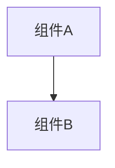

# 变更提案: network-interface-operstate-alert

## 元信息
```yaml
类型: 修复
方案类型: implementation
优先级: P1
状态: 已完成
创建: 2026-03-22
```

---

## 1. 需求

### 背景
系统监控当前用网卡累计收发字节是否大于 0 来推断 `up/down`，会把 `docker0` 这类虚拟接口误判为异常并展示告警。

### 目标
- 使用 Linux 真实链路状态替代流量推断网卡状态
- 告警面板忽略 `docker0`、`veth*`、`br-*` 等常见虚拟接口
- 保留真实物理接口或需要关注接口的异常提示能力

### 约束条件
```yaml
时间约束: 本轮直接在现有监控链路内修复，不重做整套监控模型
性能约束: 继续保持单次 SSH 批量采集，不增加额外往返
兼容性约束: 兼容现有 RightPanel/SystemMonitor 数据消费方式
业务约束: 不隐藏网卡列表本身，只调整告警判定
```

### 验收标准
- [ ] 后端返回的网卡状态来自真实 `operstate`，不再仅依赖累计流量
- [ ] `docker0`、`veth*`、`br-*` 等常见虚拟接口处于非 `up` 状态时不再进入告警卡片
- [ ] 前端构建与 Rust 检查通过，监控界面仍可展示网卡列表与状态

---

## 2. 方案

### 技术方案
在 Tauri 后端的批量监控命令中新增 `NETWORK_STATE_INFO` 段，遍历 `/sys/class/net/*/operstate` 采集真实链路状态，并结合接口名与 sysfs 路径标记接口类型（`physical / virtual / loopback`）。前端保留网卡列表展示，但告警只针对可告警接口：优先排除后端标记为 `virtual / loopback` 的接口，并对常见虚拟网卡名称做前端兜底过滤。

### 影响范围
```yaml
涉及模块:
  - system-monitor: 调整后端网络接口状态采集与返回结构
  - ui-components: 调整 RightPanel 告警过滤逻辑
  - shared-types: 扩展前端共享网络接口类型
预计变更文件: 5
```

### 风险评估
| 风险 | 等级 | 应对 |
|------|------|------|
| 个别精简系统缺少 `readlink` 或 `operstate` 信息 | 低 | 后端对状态缺失回退为 `unknown`，不阻断监控 |
| 虚拟接口命名不在常见前缀集合内 | 低 | 同时使用 sysfs 虚拟路径与前缀规则双重识别 |

---

## 3. 技术设计（可选）

> 涉及架构变更、API设计、数据模型变更时填写

### 架构设计


### API设计
#### {METHOD} {路径}
- **请求**: {结构}
- **响应**: {结构}

### 数据模型
| 字段 | 类型 | 说明 |
|------|------|------|
| {字段} | {类型} | {说明} |

---

## 4. 核心场景

> 执行完成后同步到对应模块文档

### 场景: 监控告警判定
**模块**: system-monitor / ui-components
**条件**: SSH 监控正常刷新，远端存在物理网卡与虚拟网卡
**行为**: 后端返回每个接口的真实链路状态与接口类型，前端仅对需关注的非虚拟接口做状态异常告警
**结果**: `docker0` 等虚拟接口不再误报，物理接口异常仍会在告警区显示

---

## 5. 技术决策

> 本方案涉及的技术决策，归档后成为决策的唯一完整记录

### network-interface-operstate-alert#D001: 网卡告警改为真实链路状态并忽略常见虚拟接口
**日期**: 2026-03-22
**状态**: ✅采纳
**背景**: 现有监控把“是否产生过网络流量”错误地等价成“网卡是否在线”，导致虚拟接口频繁误报，影响告警可信度。
**选项分析**:
| 选项 | 优点 | 缺点 |
|------|------|------|
| A: 读取真实 `operstate` 并忽略常见虚拟接口 | 结果更接近系统真实状态，能直接消除 `docker0` 误报 | 需要扩展后端采集与前端过滤 |
| B: 保留现有逻辑，仅对白名单接口静默 | 改动小 | 根因未修复，物理接口状态仍可能误判 |
**决策**: 选择方案 A
**理由**: 该方案同时修复状态来源和告警对象两个问题，行为更可解释，也更符合用户对“告警”的预期。
**影响**: 影响 `src-tauri/src/system_monitor.rs`、`src/components/RightPanel.vue`、`src/types/app.ts` 与相关知识库文档

---

## 6. 成果设计

> 含视觉产出的任务由 DESIGN Phase2 填充。非视觉任务整节标注"N/A"。

N/A（本次为监控逻辑修复，不涉及新的视觉产出）
