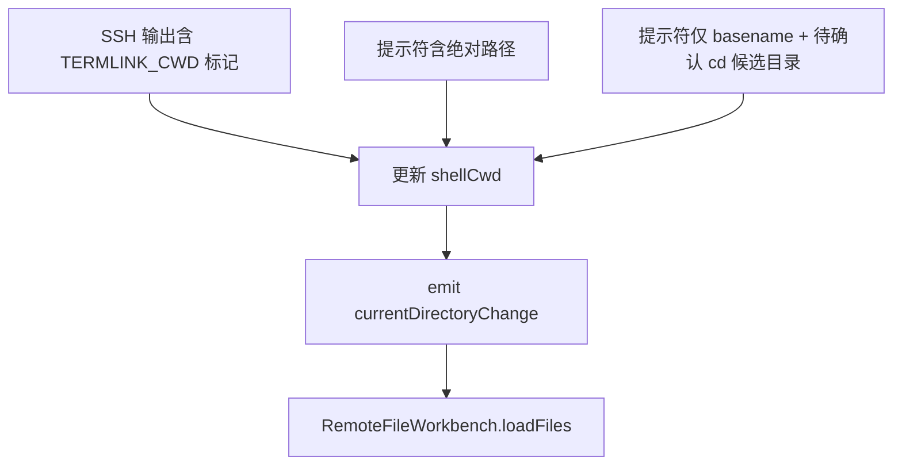

# 变更提案: ssh-cwd-sync-linux

## 元信息
```yaml
类型: 修复
方案类型: implementation
优先级: P1
状态: 已完成
创建: 2026-03-24
```

---

## 1. 需求

### 背景
SSH 终端与下方远程文件管理支持按当前工作目录联动，但现在线路对不同服务器的 shell 提示符兼容性不足。Ubuntu 上通常能通过 `PROMPT_COMMAND` 或绝对路径提示符拿到目录，Rocky Linux 常见 bash 提示符只显示 basename，导致文件管理仍停留在旧目录。

### 目标
- 让用户在 SSH 终端执行常见 `cd` 操作后，远程文件管理可靠同步到同一目录。
- 保留现有 `TERMLINK_CWD` 标记能力，并补足不依赖发行版提示符格式的兜底路径。
- 避免在 basename 提示符兜底场景下使用独立 exec 通道执行 `pwd`，防止拿到登录目录而不是当前交互终端目录。

### 约束条件
```yaml
时间约束: 本次修复优先落在现有 SSH 终端同步链路内，不扩展为新的终端协议。
性能约束: 目录同步不能引入额外的高频 SSH 往返或明显的终端输入延迟。
兼容性约束: 需兼容 bash / zsh / sh 风格提示符差异，并保留当前 Ubuntu 正常路径。
业务约束: 不改动远程文件管理核心加载逻辑，只修正目录来源。
```

### 验收标准
- [ ] Ubuntu 上现有基于标记或绝对路径提示符的目录同步行为不回退。
- [ ] Rocky Linux 上使用 basename 风格提示符时，执行常见 `cd` 命令后文件管理能同步进入目标目录。
- [ ] basename 提示符场景下的目录同步不再依赖独立 exec 通道的 `pwd` 结果。

---

## 2. 方案

### 技术方案
在 `Terminal.vue` 内把 SSH cwd 同步拆成三层来源，按权威度依次使用：

1. 继续优先消费后端注入的 `TERMLINK_CWD` 标记。
2. 对能从提示符直接解析出的绝对路径继续按现有方式更新。
3. 对 basename 或无绝对路径提示符的场景，跟踪当前终端输入中的简单 `cd` 命令，基于已知 cwd 在前端推导目标目录，并在下一次提示符返回时作为会话内兜底结果提交。

同时移除当前“提示符无法解析时走独立 `executeCommand('pwd')`”的分支，避免跨 channel 取到错误目录。

### 影响范围
```yaml
涉及模块:
  - src/components/Terminal.vue: 调整 SSH 目录同步状态机与输入跟踪逻辑
  - .helloagents/plan/202603241309_ssh-cwd-sync-linux: 记录本次修复方案和任务
预计变更文件: 3
```

### 风险评估
| 风险 | 等级 | 应对 |
|------|------|------|
| 命令输入跟踪与真实 shell 编辑状态不一致 | 中 | 仅对简单 `cd` 命令启用兜底，并在出现转义序列或复杂编辑时放弃推断 |
| 错误地在 `cd` 失败后更新目录 | 中 | 对常见 shell 错误输出做拦截，只有提示符返回且未检测到失败时才应用候选目录 |
| 影响 Ubuntu 现有 marker 路径 | 低 | 保持 marker 解析优先级最高，新增逻辑只在无权威路径时兜底 |

---

## 3. 技术设计（可选）

> 本次为现有终端状态机修复，不涉及新的 API 或数据模型。

### 架构设计


### API设计
N/A

### 数据模型
N/A

---

## 4. 核心场景

> 执行完成后同步到对应模块文档

### 场景: Rocky Linux basename 提示符
**模块**: Terminal / RemoteFileWorkbench
**条件**: 远端 shell 提示符只显示当前目录 basename，无法直接解析绝对路径
**行为**: 用户在 SSH 终端执行 `cd /var/log`、`cd ../app`、`cd ~/workspace` 等常见命令
**结果**: 终端组件在当前会话内推导出新 cwd，并驱动文件管理切换到同一路径

### 场景: Ubuntu 绝对路径提示符
**模块**: Terminal / RemoteFileWorkbench
**条件**: 远端 shell 通过 `TERMLINK_CWD` 标记或提示符输出绝对路径
**行为**: 用户执行 `cd` 后收到正常提示符输出
**结果**: 仍优先使用权威路径更新，不受兜底逻辑影响

---

## 5. 技术决策

> 本方案涉及的技术决策，归档后成为决策的唯一完整记录

### ssh-cwd-sync-linux#D001: 用会话内命令推导替代独立 `pwd` 兜底
**日期**: 2026-03-24
**状态**: ✅采纳
**背景**: 当前 basename 提示符场景会退回到 `executeCommand('pwd')`，但该命令运行在独立 SSH exec 通道中，拿到的不是当前交互 shell 的工作目录。
**选项分析**:
| 选项 | 优点 | 缺点 |
|------|------|------|
| A: 保留独立 `pwd` 兜底 | 实现简单 | 与交互终端上下文脱节，Rocky Linux 场景会返回错误目录 |
| B: 在终端会话内跟踪简单 `cd` 命令并作为兜底 | 不依赖发行版提示符格式，和当前交互会话一致 | 需要维护输入状态，并对复杂命令保持保守 |
**决策**: 选择方案 B
**理由**: 该问题的关键不是拿不到目录，而是不能脱离当前交互 shell 去取目录。会话内推导能覆盖常见 `cd` 场景，同时不需要注入可见的远程 bootstrap 命令。
**影响**: 影响 `Terminal.vue` 中的 SSH cwd 同步逻辑，以及后续与远程文件工作台的联动稳定性

---

## 6. 成果设计

N/A（本次为终端目录同步修复，无新增视觉产出）
