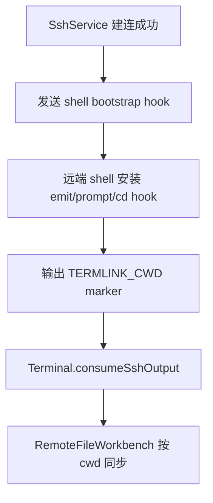

# 变更提案: ssh-cwd-shell-hook

## 元信息
```yaml
类型: 修复
方案类型: implementation
优先级: P1
状态: 已完成
创建: 2026-03-24
```

---

## 1. 需求

### 背景
上一轮仅依赖前端提示符解析和输入推导的修复后，Rocky Linux 服务器仍未同步，说明远端 shell 并没有稳定产出可被前端识别的 cwd 变化信号。继续扩大提示符兼容面价值有限，需要改成会话建立后主动上报 cwd。

### 目标
- 在 SSH 会话建立后注入一次 shell 级 cwd hook，让 Rocky Linux 在每次 prompt 和 `cd` 后都发出 `TERMLINK_CWD` 标记。
- 复用现有 `Terminal.vue` 的 marker 消费逻辑，避免继续扩散前端分支判断。
- 不回退 Ubuntu 当前已正常的目录同步路径。

### 约束条件
```yaml
时间约束: 只修改现有 SSH 连接 bootstrap 路径，不重做终端协议。
性能约束: hook 应是纯 shell 级轻量逻辑，不增加额外 SSH exec 往返。
兼容性约束: 至少覆盖 Rocky Linux 常见 bash，且对 zsh 保持无害兼容。
业务约束: 远程文件管理现有加载行为不变，仍只消费 cwd 变更事件。
```

### 验收标准
- [ ] Rocky Linux 建连后，执行 `cd /tmp`、`cd ..` 等常见命令能稳定触发文件管理同步。
- [ ] Ubuntu 现有 marker/提示符路径不回退。
- [ ] 目录同步不再依赖 Rocky 的 prompt 格式是否包含绝对路径。

---

## 2. 方案

### 技术方案
在 `SshService` 的连接后 bootstrap 命令里增加一段幂等 shell hook：

1. 定义 `__termlink_emit_cwd`，统一输出 `TERMLINK_CWD` marker。
2. 对 bash 注入 `PROMPT_COMMAND`，确保每次 prompt 前都上报 cwd。
3. 对 zsh 注入 `precmd` hook，保持兼容。
4. 重写当前会话的 `cd` shell function，在成功切换目录后立即上报 cwd。
5. 连接建立后立即执行一次 `__termlink_emit_cwd`，让初始目录也尽快可见。

### 影响范围
```yaml
涉及模块:
  - src/services/SshService.ts: 注入 shell 级 cwd hook
  - src/components/Terminal.vue: 继续消费统一 marker，无需新增分支
  - .helloagents/plan/202603241320_ssh-cwd-shell-hook: 记录第二轮修复方案
预计变更文件: 4
```

### 风险评估
| 风险 | 等级 | 应对 |
|------|------|------|
| hook 与用户自定义 `PROMPT_COMMAND`/`precmd` 干扰 | 中 | 采用前置拼接和幂等保护变量，避免重复注入 |
| `cd` function 覆盖在极少数 shell 配置中不兼容 | 中 | 仅使用最小包装，失败时仍保留现有 marker/前端兜底链路 |
| 连接首屏出现一次 bootstrap 注入痕迹 | 低 | 维持单次注入且不输出额外提示文案，优先换取 Rocky 稳定同步 |

---

## 3. 技术设计（可选）

> 本次为启动后 bootstrap 扩展，不新增 API 与数据模型。

### 架构设计


### API设计
N/A

### 数据模型
N/A

---

## 4. 核心场景

### 场景: Rocky Linux bash prompt 不含绝对路径
**模块**: SshService / Terminal / RemoteFileWorkbench
**条件**: 远端提示符只显示主机名与 basename，前端无法从 prompt 直接解析绝对路径
**行为**: 用户建立连接并在终端执行 `cd /tmp`、`cd ../app`
**结果**: shell hook 主动发出 `TERMLINK_CWD`，文件管理同步进入新目录

### 场景: Ubuntu 原有路径保持不变
**模块**: SshService / Terminal
**条件**: Ubuntu 已可通过现有 marker 或 prompt 解析目录
**行为**: 用户建立连接并执行常见 `cd`
**结果**: 继续稳定同步，新增 hook 只提供更强的一致性，不改变用户侧行为

---

## 5. 技术决策

### ssh-cwd-shell-hook#D001: 在连接 bootstrap 中注入 cwd shell hook
**日期**: 2026-03-24
**状态**: ✅采纳
**背景**: Rocky Linux 上没有稳定 prompt 信号，继续扩前端解析收益低，必须让远端 shell 主动汇报 cwd。
**选项分析**:
| 选项 | 优点 | 缺点 |
|------|------|------|
| A: 继续补前端 prompt 解析 | 不改连接 bootstrap | 依赖 prompt 形态，Rocky 已证明不可靠 |
| B: 在连接 bootstrap 中安装 shell hook | 目录信号来源统一，直接复用现有 marker 消费链 | 需要在会话启动时注入一段 shell 命令 |
**决策**: 选择方案 B
**理由**: 问题根因是远端没有持续上报 cwd，而不是前端缺少更多正则。把 cwd 变更源头收束为 shell hook，兼容面和可维护性都更好。
**影响**: 影响 SSH 连接建立后的 bootstrap 行为，以及所有依赖 `TERMLINK_CWD` 的目录联动链路

---

## 6. 成果设计

N/A（本次为连接与终端行为修复，无新增视觉产出）
