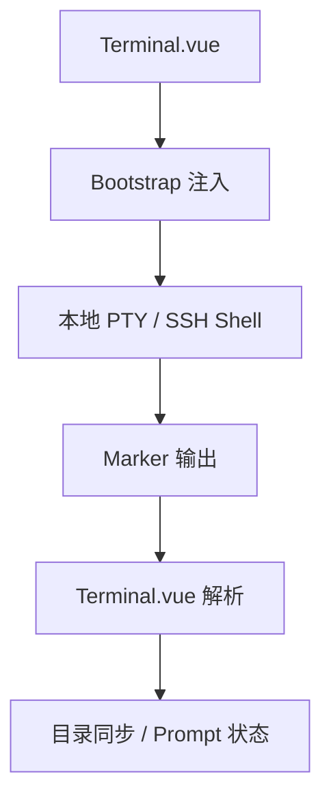

# 变更提案: terminal-shell-integration-phase1

## 元信息
```yaml
类型: 新功能
方案类型: implementation
优先级: P1
状态: 已完成
创建: 2026-03-24
```

---

## 1. 需求

### 背景
当前终端输入链路仅支持原始 PTY/SSH 字节流透传。SSH 侧已有基于 `PROMPT_COMMAND` 的 cwd 标记，但只覆盖 bash，且缺少统一的 prompt 边界与命令接受事件；本地 PTY 侧则没有任何 shell integration。后续要实现命令历史联想和 `Ctrl+E` 接受建议，必须先稳定感知 shell 的提示符、当前目录和命令生命周期。

### 目标
- 为本地 PTY 和 SSH 终端建立统一的 shell integration marker 协议。
- 支持 bash 与 zsh 两类 shell，统一输出 prompt/cwd 元信息。
- 在前端稳定解析 integration marker，并继续保持现有终端渲染与目录同步能力。

### 约束条件
```yaml
时间约束: 本轮只做第一阶段基础协议，不实现联想 UI 与 Ctrl+E 接受。
性能约束: 不引入高频 IPC 或额外轮询，协议输出仅在 prompt/命令生命周期节点发生。
兼容性约束: 本地与 SSH 都需兼容 bash/zsh；未知 shell 需静默降级，不破坏现有交互。
业务约束: 维持当前终端桌面工具风格，不新增显式 UI 面板。
```

### 验收标准
- [x] 本地 PTY 默认跟随用户 shell，并能在 bash/zsh 中注入 Termlink shell integration。
- [x] SSH 终端移除 bash 专属 `PROMPT_COMMAND` 依赖，改为 bash/zsh 通用 bootstrap 注入。
- [x] 前端能解析统一 marker，稳定更新当前目录并识别 prompt 边界，未识别 shell 时保持原样输出。
- [x] `pnpm run build` 与 `cargo check --manifest-path src-tauri/Cargo.toml` 通过。

---

## 2. 方案

### 技术方案
新增一个前端 shell integration 工具模块，负责生成 bash/zsh 通用 bootstrap 脚本和统一 marker 常量。终端建立会话后，由前端向本地 PTY 与 SSH shell 注入 bootstrap；shell 在 `precmd/preexec` 或 `PROMPT_COMMAND/DEBUG trap` 钩子中输出 marker。`Terminal.vue` 将 marker 从原始输出中过滤掉，并把 cwd/prompt 状态同步到现有终端状态机。

### 影响范围
```yaml
涉及模块:
  - src/components/Terminal.vue: 注入 bootstrap、解析 marker、统一本地与 SSH 会话状态
  - src/utils/terminalShellIntegration.ts: 统一协议常量与 bash/zsh bootstrap 生成
  - src-tauri/src/terminal.rs: 本地 PTY 默认 shell 选择逻辑调整
  - src-tauri/src/connection_manager.rs: 移除旧的 bash 专属 cwd 注入实现
预计变更文件: 4
```

### 风险评估
| 风险 | 等级 | 应对 |
|------|------|------|
| shell 钩子与用户自定义 prompt 冲突 | 中 | 采用追加式 hook，保留原有 `PROMPT_COMMAND/precmd/preexec` 行为 |
| bootstrap 回显污染终端输出 | 中 | 使用控制字符 marker 与回显过滤逻辑，屏蔽注入脚本输出 |
| 未知 shell 或受限环境 | 低 | 自动探测 bash/zsh，失败时静默降级为无 integration |

---

## 3. 技术设计（可选）

> 涉及架构变更、API设计、数据模型变更时填写

### 架构设计


### API设计
#### 终端 Marker 协议
- **输出格式**: `\u001fTERMLINK_<EVENT>[:payload]\u001f`
- **事件**:
  - `PROMPT_START`
  - `PROMPT_END`
  - `CWD:{pwd}`
  - `COMMAND:{command}`

### 数据模型
| 字段 | 类型 | 说明 |
|------|------|------|
| markerType | string | shell integration 事件类型 |
| payload | string | marker 附带的数据，如 cwd 或 command |
| promptActive | boolean | 当前是否处于普通 shell prompt 状态 |

---

## 4. 核心场景

> 执行完成后同步到对应模块文档

### 场景: 本地终端进入 shell prompt
**模块**: `src/components/Terminal.vue`
**条件**: 用户打开本地 PTY，shell 为 bash 或 zsh
**行为**: Termlink 注入 bootstrap，shell 在 prompt 生命周期输出 marker
**结果**: 前端获得 prompt 边界与 cwd 状态，不污染终端显示

### 场景: SSH 会话进入远端 shell
**模块**: `src/components/Terminal.vue` + `src-tauri/src/connection_manager.rs`
**条件**: SSH 连接建立并进入交互 shell
**行为**: 前端向远端 shell 注入 bootstrap，替代旧的 bash 专属 `PROMPT_COMMAND`
**结果**: bash/zsh 统一输出 marker，目录跟踪继续工作

---

## 5. 技术决策

> 本方案涉及的技术决策，归档后成为决策的唯一完整记录

### terminal-shell-integration-phase1#D001: 使用前端 bootstrap 注入统一 bash/zsh integration
**日期**: 2026-03-24
**状态**: ✅采纳
**背景**: 当前 SSH 仅依赖 bash 的 `PROMPT_COMMAND` 注入 cwd，本地 PTY 没有 integration。第一阶段需要低风险扩展到 bash + zsh，并同时覆盖本地与 SSH。
**选项分析**:
| 选项 | 优点 | 缺点 |
|------|------|------|
| A: 启动 shell 时通过参数/环境预注入 | 后端集中控制，启动即生效 | 本地与 SSH 两条链路实现差异大，zsh 兼容成本高 |
| B: 会话建立后由前端注入统一 bootstrap | 本地与 SSH 复用一套脚本，便于演进 marker 协议 | 需要处理 bootstrap 回显与一次性注入时机 |
**决策**: 选择方案 B
**理由**: 该方案可以最小改动复用当前终端前端状态机，同时去掉 SSH 的 bash 专属实现，后续扩展历史联想与 `Ctrl+E` 接受时也能继续沿用同一协议。
**影响**: 影响终端启动、会话绑定、输出解析三条链路，但不改变现有 SSH/SFTP 服务职责边界。

---

## 6. 成果设计

> 含视觉产出的任务由 DESIGN Phase2 填充。非视觉任务整节标注"N/A"。

N/A
