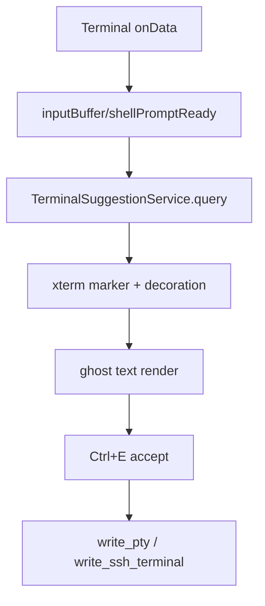

# 变更提案: terminal-inline-autosuggest-phase2

## 元信息
```yaml
类型: 新功能
方案类型: implementation
优先级: P1
状态: 已完成
创建: 2026-03-24
```

---

## 1. 需求

### 背景
第一阶段已经为本地 PTY 和 SSH 终端建立了统一 shell integration 协议，终端可以稳定识别普通 prompt 与 cwd。当前仍缺少终端联想层，用户输入命令时没有历史建议，也无法通过快捷键快速接受补全内容。

### 目标
- 基于终端当前输入前缀和 shell prompt 状态生成命令历史联想。
- 以“内联灰字 ghost text”的形式在终端中展示建议。
- 支持 `Ctrl+E` 接受当前建议，并将剩余补全文本写入 PTY/SSH。

### 约束条件
```yaml
时间约束: 本轮只做历史联想，不引入 AI 联想和多候选面板。
性能约束: 输入期间只能做前端本地查询与低成本重绘，不增加后端轮询或额外 SSH 往返。
兼容性约束: 仅在普通 shell prompt 且光标位于行尾时展示建议；连接中、断线、全屏程序和非 prompt 状态必须自动停用。
业务约束: UI 风格保持现有终端黑白克制基调，ghost text 需尽量接近真实内联效果，不新增明显面板。
```

### 验收标准
- [x] 终端在普通 prompt 下输入历史命令前缀时，能展示灰色内联建议，且不污染实际 PTY/SSH 输入。
- [x] `Ctrl+E` 可以接受当前建议尾巴，并把追加内容写入本地 PTY 或 SSH 终端。
- [x] 已执行的命令会按终端上下文写入本地历史库，后续同前缀可再次命中。
- [x] `pnpm run build` 与 `cargo check --manifest-path src-tauri/Cargo.toml` 通过。

---

## 2. 方案

### 技术方案
新增一个终端建议服务，按 `scope(terminalType + host/user + cwd) + prefix` 管理历史命令。`Terminal.vue` 基于第一阶段已有的 `inputBuffer / shellPromptReady / cwd` 状态，在光标位于行尾时查询建议；展示层采用 xterm `registerMarker + registerDecoration` 挂 DOM 元素，视觉上贴在当前输入尾部，形成“伪内联灰字 ghost text”。建议接受时只将尚未输入的尾巴写入后端，不直接改动真实终端 buffer。

### 影响范围
```yaml
涉及模块:
  - src/components/Terminal.vue: 建议状态、ghost text decoration、Ctrl+E 接受、历史写入触发
  - src/services/TerminalSuggestionService.ts: 终端命令历史存储、查询与排序
  - src/utils/terminalShellIntegration.ts: 复用第一阶段 prompt/cwd 状态，不新增协议
  - src/style.css: ghost text 装饰层样式
预计变更文件: 4
```

### 风险评估
| 风险 | 等级 | 应对 |
|------|------|------|
| xterm decoration 与终端重绘错位 | 中 | 以 marker + decoration 渲染，窗口缩放/主题切换/输出刷新时重建 decoration |
| 行编辑状态与真实 shell 输入不一致 | 中 | 只在 `shellPromptReady + 行尾 + 非控制序列输入` 条件下展示，遇到箭头/控制键立即清空建议 |
| SSH/全屏程序误触发建议 | 中 | 利用第一阶段 prompt marker gating，只有普通 prompt 状态才允许建议可见 |

---

## 3. 技术设计（可选）

> 涉及架构变更、API设计、数据模型变更时填写

### 架构设计


### API设计
#### TerminalSuggestionService
- **save(scope, command)**: 写入一条已执行命令历史
- **query(scope, prefix)**: 返回当前前缀的最佳建议
- **clearTransient(scope)**: 清理无效临时状态（如有）

### 数据模型
| 字段 | 类型 | 说明 |
|------|------|------|
| TerminalSuggestionScope | object | 建议命中范围，包含 terminalType、host、user、cwd |
| TerminalSuggestionEntry | object | 历史命令项，包含 command、usedAt、hitCount |
| TerminalGhostTextState | object | 当前建议及其 decoration/marker 生命周期状态 |

---

## 4. 核心场景

> 执行完成后同步到对应模块文档

### 场景: 普通 prompt 下显示历史联想
**模块**: `src/components/Terminal.vue`
**条件**: shell marker 指示当前在 prompt，用户正在行尾输入普通字符
**行为**: 终端查询当前前缀的历史建议，并以内联灰字展示剩余尾巴
**结果**: 用户在不打断终端输入流的前提下看到即时建议

### 场景: `Ctrl+E` 接受建议
**模块**: `src/components/Terminal.vue`
**条件**: 当前存在可见建议且终端处于活动状态
**行为**: 终端将建议剩余尾巴写入 PTY/SSH，并同步更新本地输入缓冲与 ghost text
**结果**: 建议变为真实输入内容，用户可继续编辑或直接回车执行

---

## 5. 技术决策

> 本方案涉及的技术决策，归档后成为决策的唯一完整记录

### terminal-inline-autosuggest-phase2#D001: 使用 xterm decoration 实现伪内联 ghost text
**日期**: 2026-03-24
**状态**: ✅采纳
**背景**: 用户明确要求第一版直接做接近截图的“内联灰字”效果，但完整接管字符栅格或自实现行编辑风险过高。
**选项分析**:
| 选项 | 优点 | 缺点 |
|------|------|------|
| A: 直接改真实 buffer 渲染 ghost 字符 | 视觉最原生 | 会污染终端真实内容，和 shell 状态容易打架 |
| B: xterm decoration 挂载 DOM ghost text | 视觉上接近内联，能独立控制生命周期 | 需要处理定位和重绘 |
**决策**: 选择方案 B
**理由**: 该方案不改变 PTY/SSH 实际输入输出，只在展示层追加 ghost text，能在保证接近截图观感的同时维持终端状态机的可靠性。
**影响**: 主要影响 `Terminal.vue` 的输入状态和渲染逻辑，并新增建议存储服务；不要求修改 Rust 终端协议。

---

## 6. 成果设计

> 含视觉产出的任务由 DESIGN Phase2 填充。非视觉任务整节标注"N/A"。

### 设计方向
- **美学基调**: 黑白克制的终端原生感，ghost text 只作为弱提示存在，不能像输入法候选那样抢视觉焦点
- **记忆点**: 建议内容像真实命令尾巴一样“贴”在当前输入后面，几乎不破坏终端信息密度
- **参考**: 用户提供的截图风格；Warp/fish autosuggestion 的灰色尾巴感

### 视觉要素
- **配色**: 使用当前终端前景色的低对比度变体，深色终端下偏暖灰白，浅色终端下偏冷灰
- **字体**: 与终端当前字体完全一致，避免任何额外字体切换导致错位
- **布局**: 单行内联，不引入面板、标签或边框；建议内容紧跟当前输入尾部
- **动效**: 不做显式动画，仅允许轻量透明度切换，避免终端闪动
- **氛围**: 保持终端画布纯净，ghost text 应像终端原生的一部分而不是浮层组件

### 技术约束
- **可访问性**: 仅作为辅助提示，不取代真实输入；键盘接受路径必须明确且可关闭/隐藏
- **响应式**: 跟随终端字号、行高和窗口尺寸自动重算，不单独定义断点
