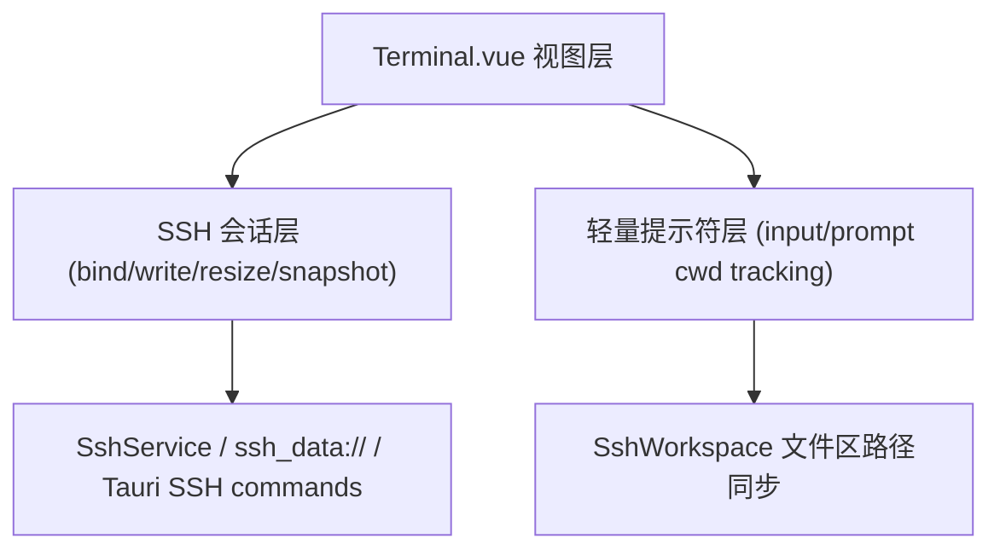

# 变更提案: ssh_terminal_ssh_only_core_rebuild

## 元信息
```yaml
类型: 重构
方案类型: implementation
优先级: P1
状态: 已完成
创建: 2026-03-25
```

---

## 1. 需求

### 背景
现有终端实现长期把本地 PTY 与 SSH 终端共用在同一个组件内，同时叠加了 shell integration、cwd marker、历史联想和输入缓冲追踪等多层增强逻辑。近期 SSH 会话已经出现提示符消失、按上键后无法继续输入，甚至登录后直接没有可交互 prompt 的问题，说明现有耦合方式已经不适合继续修补。

### 目标
- 将终端能力收口为 SSH 单栈实现，不再维护前端本地终端入口。
- 重构 `Terminal.vue` 为分层结构：SSH 会话层、轻量提示符/目录追踪层、展示层。
- 先恢复 SSH 终端的稳定可用性：正常显示、输入、回车、上下历史和重连。

### 约束条件
```yaml
时间约束: 本轮优先恢复 SSH 终端可用性，不在同一轮加回复杂增强能力
性能约束: 不能引入额外高频命令轮询或阻塞输入事件的同步逻辑
兼容性约束: 保持现有 SSH 会话、分屏广播、远程文件工作台与 Tauri SSH 通道可用
业务约束: 本地终端入口从前端移除，终端体验以 SSH 为唯一事实来源
```

### 验收标准
- [x] SSH 登录后能稳定看到终端输出与提示状态，不再依赖 shell marker 注入
- [x] SSH 终端可正常输入、回车执行、上下历史回显与粘贴
- [x] 应用前端不再保留 `local` 终端标签入口
- [x] `pnpm run build` 通过

---

## 2. 方案

### 技术方案
采用“SSH 单栈分层重构”方案：
- 将 `Terminal.vue` 重写为 SSH-only 组件，只保留 xterm 展示、SSH 会话绑定、输入透传、resize、右键菜单和连接态 overlay。
- 移除本地 PTY 分支、shell integration marker 注入和内联历史联想，把 shell 行为尽量还给远端真实 shell。
- 保留一层轻量提示符追踪：仅通过原始输出解析常见 prompt，并结合简单 `cd` 命令跟踪当前目录，继续为工作台文件区提供基础路径同步。
- 在 `App.vue`、`TabManager.vue`、`types/app.ts` 和 `SshWorkspace.vue` 中去掉本地终端入口，完成 SSH 单栈收口。

### 影响范围
```yaml
涉及模块:
  - Terminal: SSH 终端核心会话层与展示层重写
  - App Shell: 移除本地终端标签入口
  - Workspace UI: SSH 工作区终端挂载参数收口
预计变更文件: 7
```

### 风险评估
| 风险 | 等级 | 应对 |
|------|------|------|
| 轻量 prompt 解析覆盖不到特殊 shell 提示符 | 中 | 先保底终端可用，路径同步退化不阻断输入 |
| 旧终端增强能力被移除后体验下降 | 低 | 当前以稳定性优先，后续按层次逐步加回 |
| 移除本地终端入口影响旧 UI 假设 | 低 | 同步清理 `App.vue`、`TabManager.vue` 与类型定义 |

---

## 3. 技术设计（可选）

> 涉及架构变更、API设计、数据模型变更时填写

### 架构设计


---

## 4. 核心场景

> 执行完成后同步到对应模块文档

### 场景: SSH 单栈核心交互
**模块**: Terminal / App Shell
**条件**: 用户打开 SSH 工作区并建立连接
**行为**: 终端展示远端输出，用户继续输入命令、按上下历史、回车执行、右键复制粘贴
**结果**: 终端稳定可用，且应用中不再暴露本地终端标签入口

---

## 5. 技术决策

> 本方案涉及的技术决策，归档后成为决策的唯一完整记录

### ssh_terminal_ssh_only_core_rebuild#D001: 采用 SSH 单栈分层重构替代继续修补混合终端
**日期**: 2026-03-25
**状态**: ✅采纳
**背景**: 当前问题已经说明“本地 PTY + SSH + shell marker + 联想增强”混合在一个组件里会持续放大风险，继续打补丁只会继续失稳。
**选项分析**:
| 选项 | 优点 | 缺点 |
|------|------|------|
| A: SSH 单栈最小核心重构 | 风险最低，恢复可用性最快 | 后续加回增强能力的结构空间不足 |
| B: SSH 单栈分层重构 | 既先保住稳定性，又给后续增强能力留出明确分层 | 首轮改动面比 A 更大 |
**决策**: 选择方案 B
**理由**: 当前不只是一个 bug，而是职责边界问题。方案 B 能在同一轮里把 SSH 核心会话、轻量提示符层和 UI 展示层拆开，后续再加能力时不必重新推倒。
**影响**: 影响 `src/components/Terminal.vue`、`src/App.vue`、`src/components/SshWorkspace.vue`、`src/components/TabManager.vue`、`src/types/app.ts`

---

## 6. 成果设计

> 含视觉产出的任务由 DESIGN Phase2 填充。非视觉任务整节标注"N/A"。

N/A（非视觉任务）
