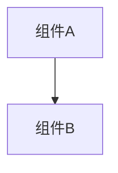

# 变更提案: ssh_only_remove_local_pty_backend

## 元信息
```yaml
类型: 重构
方案类型: implementation
优先级: P2
状态: 已完成
创建: 2026-03-25
```

---

## 1. 需求

### 背景
前一轮已经把前端终端收口为 SSH-only，但仓库中仍保留了 Rust 侧本地 PTY 模块、命令注册和相关文档说明。这些残留代码已经没有前端入口，继续保留只会增加维护噪音和误导。

### 目标
- 删除后端本地 PTY 模块与命令注册。
- 删除与 `restart_ssh_connection()` 绑定的无效清理逻辑。
- 将 README、前后端 CLAUDE 文档更新为 SSH-only 现状。

### 约束条件
```yaml
时间约束: 在当前 SSH 单栈重构基础上立即收尾
性能约束: 不影响现有 SSH 终端和 SFTP/监控链路
兼容性约束: 保持现有前端和 Tauri 命令集通过构建校验
业务约束: 清理范围只针对无入口的本地 PTY 后端与文档残留
```

### 验收标准
- [x] `src-tauri/src/terminal.rs` 被移除
- [x] `src-tauri/src/lib.rs` 不再注册本地 PTY 与 `restart_ssh_connection`
- [x] `cargo check --manifest-path src-tauri/Cargo.toml` 与 `pnpm run build` 通过
- [x] README 与 CLAUDE 文档更新为 SSH-only

---

## 2. 方案

### 技术方案
直接删除后端本地 PTY 模块与命令入口：
- 在 `src-tauri/src/lib.rs` 中移除 `mod terminal;` 和 `start_pty/write_pty/resize_pty/close_pty` 注册。
- 在 `src-tauri/src/ssh.rs` 中删除仅调用 `terminal::close_pty` 的 `restart_ssh_connection()`。
- 删除 `src-tauri/src/terminal.rs` 文件。
- 同步更新 README、`src/CLAUDE.md`、`src-tauri/CLAUDE.md` 与知识库文档，避免继续出现本地终端描述。

### 影响范围
```yaml
涉及模块:
  - desktop-backend: 删除本地 PTY 模块和命令注册
  - app-shell: 文档与说明更新为 SSH-only
预计变更文件: 7
```

### 风险评估
| 风险 | 等级 | 应对 |
|------|------|------|
| 文档遗漏残留旧说法 | 低 | 用全文搜索清点 `start_pty/close_pty/restart_ssh_connection` |
| 清理误伤 SSH 后端编译 | 低 | 运行 `cargo check` 验证 |

---

## 3. 技术设计（可选）

> 涉及架构变更、API设计、数据模型变更时填写

### 架构设计


### API设计
#### {METHOD} {路径}
- **请求**: {结构}
- **响应**: {结构}

### 数据模型
| 字段 | 类型 | 说明 |
|------|------|------|
| {字段} | {类型} | {说明} |

---

## 4. 核心场景

> 执行完成后同步到对应模块文档

### 场景: SSH-only 后端收尾
**模块**: desktop-backend
**条件**: 前端已不再暴露本地终端入口
**行为**: 删除本地 PTY 模块、命令注册和失效重连清理逻辑
**结果**: 后端命令面与文档和实际产品一致，仓库不再残留无入口本地终端代码

---

## 5. 技术决策

> 本方案涉及的技术决策，归档后成为决策的唯一完整记录

### ssh_only_remove_local_pty_backend#D001: 删除无入口本地 PTY 后端而非继续保留兼容壳
**日期**: 2026-03-25
**状态**: ✅采纳
**背景**: 当前产品方向已经明确为 SSH-only，继续保留 Rust 本地 PTY 只是增加误导和维护面。
**选项分析**:
| 选项 | 优点 | 缺点 |
|------|------|------|
| A: 直接删除本地 PTY 后端 | 代码和文档一致，后续维护更清晰 | 若未来要恢复本地终端需要重新实现 |
| B: 保留后端代码，仅隐藏入口 | 改动更少 | 长期残留死代码，继续误导维护者 |
**决策**: 选择方案 A
**理由**: 当前需求是彻底收口 SSH-only；后端若保留本地 PTY，只会让真实产品边界继续模糊。
**影响**: 影响 `src-tauri/src/lib.rs`、`src-tauri/src/ssh.rs`、`src-tauri/src/terminal.rs`、README 与 CLAUDE 文档

---

## 6. 成果设计

> 含视觉产出的任务由 DESIGN Phase2 填充。非视觉任务整节标注"N/A"。

N/A（非视觉任务）
