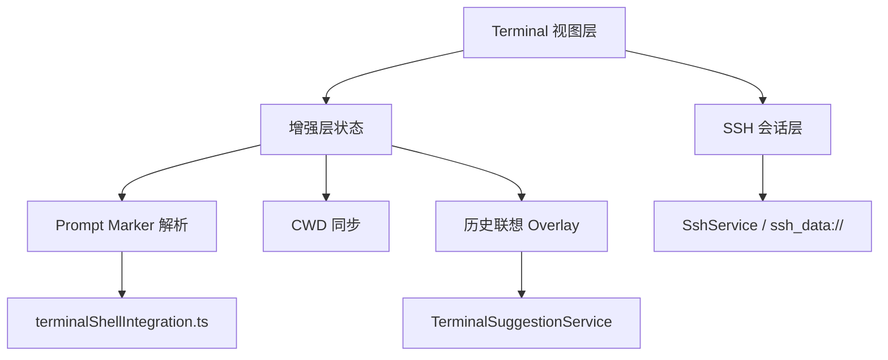

# 变更提案: ssh_terminal_enhancers_recovery

## 元信息
```yaml
类型: 优化
方案类型: implementation
优先级: P1
状态: 已完成
创建: 2026-03-25
```

---

## 1. 需求

### 背景
前一轮 SSH-only 单栈重构已经把终端核心输入输出稳定下来，但同时也暂时移除了历史联想、prompt marker 和增强型 cwd 同步。现在要在不重新破坏 SSH 会话层稳定性的前提下，把这三项增强能力按“可插拔增强层”方式补回。

### 目标
- 恢复 SSH 终端的历史联想能力，支持主机级隔离和终端内联提示。
- 恢复 prompt marker 注入与解析，并让 cwd 同步回到“marker 优先、prompt 解析兜底”。
- 保持当前 SSH 会话层稳定，增强层任一失效时不阻断终端基本可用。

### 约束条件
```yaml
时间约束: 在当前 SSH-only 代码基础上逐层加回，不重写会话层
性能约束: 联想查询不能阻塞输入回调；marker 解析不能引入明显重绘抖动
兼容性约束: 保持 SSH 工作区分屏、广播输入和文件区路径联动
业务约束: 增强能力必须是可退化层，不能重新耦合回 SSH 核心链路
```

### 验收标准
- [x] 历史联想恢复，并支持 `Ctrl+E` / `Tab` / `→` 接受建议
- [x] prompt marker 注入与解析恢复，bootstrap echo 不回显到终端
- [x] cwd 同步恢复到“marker 优先、prompt 解析兜底”，文件区路径联动继续可用
- [x] `pnpm run build` 通过

---

## 2. 方案

### 技术方案
采用“可插拔增强层回归”方案：
- 保持现有 SSH 会话层不动，继续由 `bindSession()`、`ssh_data://`、`writeTerminal()` 和 `resizeTerminal()` 负责原始会话。
- 在 `Terminal.vue` 上方重新接入增强层状态：shell integration marker 缓冲、输入缓冲、cwd 追踪、建议 overlay。
- prompt marker 通过 `terminalShellIntegration.ts` 提供的 bootstrap 受控注入；解析时先剥离 bootstrap echo，再消费 `PROMPT_START / PROMPT_END / CWD` marker。
- cwd 同步优先使用 marker，遇到 marker 不可用时回退到常见 prompt 与简单 `cd` 命令推导。
- 历史联想继续复用 `TerminalSuggestionService`，并通过终端 overlay 渲染，不直接篡改 shell 行为。

### 影响范围
```yaml
涉及模块:
  - Terminal: 增强层状态、marker 解析、联想 overlay、历史预热
  - services: TerminalSuggestionService 继续作为 SSH 历史联想来源
  - utils: terminalShellIntegration 重新作为受控注入脚本使用
预计变更文件: 4
```

### 风险评估
| 风险 | 等级 | 应对 |
|------|------|------|
| marker 注入再次干扰输入链路 | 中 | 保持单一注入源，只在 `Terminal.vue` 受控调用，不再通过 `SshService` 重复注入 |
| 联想 overlay 与 xterm 光标位置错位 | 低 | 通过 `measureProbe + textarea` 定位，且仅在 prompt ready 或可见 prompt 时显示 |
| cwd 解析覆盖不到特殊 shell prompt | 低 | marker 优先，失败时回退到现有轻量 prompt 推导，不阻断终端可用性 |

---

## 3. 技术设计（可选）

> 涉及架构变更、API设计、数据模型变更时填写

### 架构设计


---

## 4. 核心场景

> 执行完成后同步到对应模块文档

### 场景: SSH 增强能力回归
**模块**: Terminal
**条件**: SSH 会话已建立，用户进入可交互 shell
**行为**: 终端注入 prompt marker、同步 cwd、显示历史联想，并允许用户接受建议
**结果**: 终端既保留当前稳定输入链路，也恢复 marker/cwd/联想三项增强能力

---

## 5. 技术决策

> 本方案涉及的技术决策，归档后成为决策的唯一完整记录

### ssh_terminal_enhancers_recovery#D001: 以可插拔增强层方式恢复 marker、cwd 与联想
**日期**: 2026-03-25
**状态**: ✅采纳
**背景**: 当前 SSH-only 单栈已经稳定，但缺少增强能力；如果直接把旧逻辑整块塞回去，会重新和会话层耦合。
**选项分析**:
| 选项 | 优点 | 缺点 |
|------|------|------|
| A: 可插拔增强层回归 | 风险低，能保持 SSH 核心链路稳定，能力可单独退化 | 状态编排代码会增加 |
| B: 终端语义状态机 | 长期最强，抽象更完整 | 首轮工程量更大，回归风险更高 |
**决策**: 选择方案 A
**理由**: 当前目标是“把能力加回来但别再打坏 SSH 会话层”。A 最符合这个边界。
**影响**: 影响 `src/components/Terminal.vue`，并重新接回 `TerminalSuggestionService` 与 `terminalShellIntegration.ts`

---

## 6. 成果设计

> 含视觉产出的任务由 DESIGN Phase2 填充。非视觉任务整节标注"N/A"。

N/A（非视觉任务）
