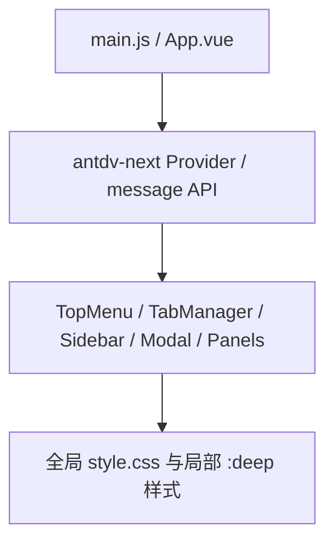

# 变更提案: antdv-next-migration

## 元信息
```yaml
类型: 重构
方案类型: implementation
优先级: P1
状态: 已确认
创建: 2026-03-18
```

---

## 1. 需求

### 背景
当前项目依赖 `ant-design-vue@4.2.6` 与 `@ant-design/icons-vue`。用户希望迁移到 `antdv-next`，并以官方迁移文档为基准完成依赖替换、组件 API 适配、图标迁移与样式兼容处理。

### 目标
- 将前端 UI 依赖从 `ant-design-vue` 迁移到 `antdv-next`
- 将图标依赖从 `@ant-design/icons-vue` 迁移到 `@antdv-next/icons`
- 保留现有布局、深浅主题和主要交互手感
- 修复迁移后因 API 或 DOM 结构调整导致的模板、脚本和样式兼容问题

### 约束条件
```yaml
时间约束: 本轮内完成可构建、可运行的前端迁移
性能约束: 不引入额外运行时状态管理或大范围无关重构
兼容性约束:
  - 需兼容 Vue 3.5、Vite 7、Tauri 2 现有运行环境
  - 需遵循 antdv-next 官方迁移文档与组件 API
业务约束:
  - 不改变现有核心功能流转
  - 优先保持用户当前使用习惯与主题视觉
```

### 验收标准
- [ ] `package.json` 中不再依赖 `ant-design-vue` 和 `@ant-design/icons-vue`
- [ ] 前端入口和组件代码改为使用 `antdv-next` 与 `@antdv-next/icons`
- [ ] `npm run build` 可以通过
- [ ] 常用界面区域在迁移后保持现有布局和深浅主题体验，无明显结构性回退

---

## 2. 方案

### 技术方案
基于官方迁移文档进行整库迁移，分四层推进：
1. 替换依赖、入口注册与全局样式引入。
2. 迁移消息 API、图标导入和模板组件用法。
3. 对 `Menu`、`Tabs`、`Dropdown`、`Select`、`Input.Group`、`Button.Group` 等兼容点进行结构性改写。
4. 调整全局和局部 `.ant-*` 选择器，使其适配 `antdv-next` 的 DOM 结构与类名语义。

### 影响范围
```yaml
涉及模块:
  - app-shell: 入口注册、消息 API、主题相关样式
  - ui-components: 顶部菜单、标签栏、左侧栏、文件管理、设置与 SSH 模态框、监控和下载区
  - services: 仅受 UI API 调用方式影响，预期少量或不改动
预计变更文件: 12-16
```

### 风险评估
| 风险 | 等级 | 应对 |
|------|------|------|
| 旧版组件 API 在 `antdv-next` 中废弃或语义变化 | 高 | 对照迁移文档逐项替换，优先处理 `Menu/Tabs/Dropdown/Select` |
| 自定义 `.ant-*` 样式依赖内部 DOM，迁移后界面走样 | 高 | 结合受影响组件逐块调整样式，并在构建后针对关键区域复查 |
| 编程式调用如 `Dropdown`/`Modal`/`message` 行为变化 | 中 | 保留原交互语义，必要时改为推荐写法 |
| 图标包替换导致组件导入失败 | 中 | 全量替换图标来源并执行构建验证 |

---

## 3. 技术设计（可选）

> 本次不涉及后端 API 或数据模型变更，重点是前端组件库迁移。

### 架构设计


### API设计
N/A

### 数据模型
N/A

---

## 4. 核心场景

> 执行完成后同步到对应模块文档

### 场景: 应用启动与全局 UI 注册
**模块**: app-shell
**条件**: 启动 Vue 应用
**行为**: 注册 `antdv-next` 组件库、引入样式并初始化全局消息能力
**结果**: 应用可正常挂载，消息提示与主题样式可用

### 场景: 连接与设置相关模态框交互
**模块**: ui-components
**条件**: 用户打开 SSH 连接或设置对话框
**行为**: 表单组件、输入组、按钮和选择器按新 API 工作
**结果**: 对话框可以正常编辑、校验、提交和关闭

### 场景: 侧边栏、顶部菜单和标签页导航
**模块**: ui-components
**条件**: 用户切换会话、展开菜单或操作下拉项
**行为**: 菜单、标签页、下拉菜单和列表区域在新 DOM 结构下保持现有体验
**结果**: 导航和上下文操作可继续使用，视觉不出现明显错位

---

## 5. 技术决策

> 本方案涉及的技术决策，归档后成为决策的唯一完整记录

### antdv-next-migration#D001: 保持现有交互体验的兼容迁移
**日期**: 2026-03-18
**状态**: ✅采纳
**背景**: 用户明确要求迁移到 `antdv-next`，同时尽量保持当前布局、深浅主题与交互手感不变。
**选项分析**:
| 选项 | 优点 | 缺点 |
|------|------|------|
| A: 保守兼容迁移 | 保留现有用户体验，回归范围明确，可逐块验证 | 需要处理更多 API 与样式兼容细节 |
| B: 迁移后尽量回归默认样式 | 实施更快，样式适配成本低 | 用户体验变化大，易产生明显视觉回退 |
**决策**: 选择方案 A
**理由**: 当前项目 UI 区域集中但样式依赖较深，用户更重视使用手感延续性，因此优先投入兼容改造而不是简单替换依赖。
**影响**: 影响 `main.js`、`App.vue`、多数 `src/components/*.vue` 和 `src/style.css`

---

## 6. 成果设计

> 含视觉产出的任务由 DESIGN Phase2 填充。非视觉任务整节标注"N/A"。

### 设计方向
- **美学基调**: 延续现有的桌面工具质感，强调深色终端工作台与浅色管理面板两套主题的稳定切换，不引入新的视觉语言
- **记忆点**: 左右双侧面板与顶部导航、标签栏组成的紧凑工作台式布局
- **参考**: 以当前项目运行态为准，迁移过程中保持布局密度和交互节奏

### 视觉要素
- **配色**: 保持现有主题变量体系，以蓝色主强调和深浅背景切换为核心
- **字体**: 保持当前系统/桌面应用默认字体栈，不在本次迁移中更换字体体系
- **布局**: 保持顶部菜单、左侧连接管理、中央标签内容区、右侧监控下载面板的工作台式布局
- **动效**: 沿用组件默认切换反馈，不额外新增动效
- **氛围**: 延续当前简洁桌面工具风格，以边框、阴影和主题变量维持层次

### 技术约束
- **可访问性**: 保持表单、按钮、菜单的语义结构，避免因迁移破坏可点击区域
- **响应式**: 以桌面窗口布局为主，维持现有弹性布局与面板折叠行为
