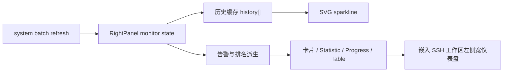

# 变更提案: monitor-dashboard-redesign

## 元信息
```yaml
类型: 重构
方案类型: implementation
优先级: P1
状态: 已确认
创建: 2026-03-20
```

---

## 1. 需求

### 背景
当前 SSH 工作区内嵌的系统监控仍沿用窄侧栏思路，主要问题是纵向线性堆叠、关键指标视觉弱、留白偏多，整体更像传统状态页，而不是现代运维仪表盘。用户已明确指出希望监控只占页面左侧约 900–1100px 区域，右侧继续留给 SSH 终端、日志或文件区。

### 目标
- 将 SSH 工作区中的系统监控改造为现代运维仪表盘式布局
- 监控内容固定承载在左侧宽面板中，常见桌面宽度下可用宽度控制在 900–1100px
- 使用 Vue 3 Composition API + `antdv-next` 组件体系完成卡片、统计、进度、表格和告警布局
- 强化 CPU、内存、磁盘、网络、Top 进程等运维核心信息的视觉层级
- 在不引入额外图表库的前提下补齐小型趋势图和状态告警

### 约束条件
```yaml
技术约束:
  - 保持现有 Vue 3 + TypeScript + antdv-next 技术栈
  - 尽量复用现有系统监控数据结构与刷新链路，不新增后端接口
  - 不破坏右侧下载面板与 SSH 工作区现有交互
视觉约束:
  - 主色 #1890ff
  - 成功 #52c41a
  - 警告 #faad14
  - 危险 #f5222d
  - 背景以 #f0f2f5 / 白色为主
  - 卡片轻阴影，圆角 6–8px，padding 12–20px
交互约束:
  - 进度条与圆环必须按 0–60% / 60–85% / >85% 分级着色
  - 监控面板继续支持当前嵌入 SSH 工作区和折叠能力
```

### 验收标准
- [ ] SSH 工作区中的监控区域改为左侧宽面板，桌面常见宽度下主内容约为 900–1100px
- [ ] 页面整体由卡片、Statistic、Progress、小型趋势图和 Table 构成，不再是线性信息堆叠
- [ ] CPU、内存、磁盘的主指标具备明显的视觉优先级和颜色分级
- [ ] 页面包含 Top 进程排序、告警信息和趋势视图
- [ ] `pnpm run build` 可通过

---

## 2. 方案

### 技术方案
本次以 `src/components/RightPanel.vue` 为主战场，在 `embedded + monitor` 路径下重构监控模板、派生状态和样式，不改变下载管理路径。核心策略如下：

1. 保留现有批量监控数据刷新逻辑，增加前端短周期历史缓存，用于 CPU / 内存 / 网络吞吐的小型趋势图。
2. 将嵌入式监控从窄侧栏扩展为左侧宽仪表盘，并为 SSH 工作区保留右侧终端/文件区域。
3. 使用 `a-card`、`a-statistic`、`a-progress`、`a-alert`、`a-table` 组合构建现代控制台布局。
4. 将系统信息改造成概览卡片与标签化信息块，减少“左标签右值”的旧式行布局。
5. 用前端派生计算补齐告警、Top 进程排序、根磁盘优先展示和网络接口活跃度。

### 影响范围
```yaml
涉及模块:
  - ui-components: RightPanel、SshWorkspace
  - knowledge-base: ui-components 模块文档、CHANGELOG、方案包
预计变更文件: 5-6
预计复杂度: moderate
```

### 风险评估
| 风险 | 等级 | 应对 |
|------|------|------|
| 宽监控面板挤压 SSH 主工作区，导致右侧内容可用面积下降 | 中 | 仅在 `embedded + monitor` 场景启用宽布局，并通过 `clamp()` 控制上限 |
| 未引入图表库时，小型趋势图可读性不足 | 中 | 使用轻量 SVG sparkline，保证信息表达清晰，避免额外依赖 |
| 组件样式改动误伤下载管理面板 | 中 | 样式严格收口到 `.right-panel--embedded.right-panel--monitor` 和监控专属类名 |
| 现有监控数据维度有限，无法支持真实时间序列或复杂告警 | 低 | 通过前端缓存补足短期趋势，告警基于现有指标阈值生成 |

---

## 3. 技术设计

### 架构设计


### 数据设计
- 保留现有 `SystemInfoBatch`、`CpuInfo`、`MemoryInfo`、`DiskInfo`、`NetworkInfo`、`ProcessInfo`
- 新增前端局部派生：
  - `lastUpdate`
  - `cpuHistory / memoryHistory / diskHistory / rxHistory / txHistory`
  - `primaryDisk`
  - `dashboardAlerts`
  - `topProcesses`

---

## 4. 核心场景

### 场景: SSH 工作区左侧宽仪表盘
**模块**: ui-components
**条件**: 用户进入 SSH 标签，且系统监控嵌入左侧展示
**行为**: 左侧展示宽仪表盘，右侧保留终端与文件区域
**结果**: 监控与操作区层级清晰，布局不再像窄侧栏

### 场景: 运维关键指标概览
**模块**: ui-components
**条件**: 监控数据刷新成功
**行为**: CPU / 内存 / 根磁盘 / 网络吞吐以统计卡、分级进度和趋势图展示
**结果**: 用户能在首屏快速识别资源风险

### 场景: 进程与告警查看
**模块**: ui-components
**条件**: 进程和资源数据可用
**行为**: 展示排序后的 Top 进程表和基于阈值生成的告警列表
**结果**: 用户可快速定位最值得关注的系统负载来源

---

## 5. 技术决策

### monitor-dashboard-redesign#D001: 在现有 RightPanel 上做嵌入式宽仪表盘扩展
**日期**: 2026-03-20
**状态**: ✅采纳
**背景**: 用户已确认采用“直接把当前 RightPanel 的监控面板扩展成约 960px 左右的左侧仪表盘，并保留现有嵌入工作区结构”的方式。
**选项分析**:
| 选项 | 优点 | 缺点 |
|------|------|------|
| A: 在现有 RightPanel 基础上扩展宽仪表盘 | 改动聚焦，能复用监控刷新和面板折叠链路，风险可控 | 需要在同一组件内兼容两套密度完全不同的布局 |
| B: 新建独立监控工作台组件 | 结构更纯净，长期扩展更舒服 | 接线和状态迁移成本更高，当前回合收益不如 A |
**决策**: 选择方案 A
**理由**: 现有嵌入式监控已经与 SSH 工作区耦合，继续沿用 `RightPanel` 更容易在本轮内交付视觉和交互收益，同时控制影响范围。
**影响**: 主要影响 `RightPanel.vue` 的模板、样式和前端派生状态，次要影响 `SshWorkspace.vue` 的小屏适配

---

## 6. 成果设计

### 设计方向
- **美学基调**: 现代云控制台 / 运维驾驶舱，偏阿里云后台的理性蓝白风格
- **记忆点**: 左侧一整块宽仪表盘，首屏就能看到强弱分明的资源状态、告警和 Top 进程
- **视觉态度**: 减少旧式信息列表，强化统计块、色彩分级和轻量趋势图

### 视觉要素
- **配色**: 以 `#1890ff` 为主色，绿色 / 黄色 / 红色承担健康分级
- **布局**: 顶部概览 + 中部双列仪表盘 + 底部磁盘与网络明细，整体左侧定宽承载
- **组件风格**: 白底或浅灰底卡片，6–8px 圆角，轻阴影，内部采用 12–20px 紧凑 padding
- **图形元素**: 进度条、dashboard 圆环、SVG sparkline、小状态胶囊
- **动效**: 延续现有轻量过渡，不增加复杂动画

### 技术约束
- 不引入 ECharts 等额外图表依赖
- 优先依赖 `antdv-next` 原生组件能力与局部 SVG/CSS 图形
