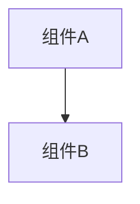

# 变更提案: remote-file-multiselect-context-menu

## 元信息
```yaml
类型: 修复/优化
方案类型: implementation
优先级: P1
状态: 已确认
创建: 2026-03-20
```

---

## 1. 需求

### 背景
远程文件工作台当前只支持单行选中与单项右键菜单，缺少拖拽框选/连续多选能力。用户在文件列表中无法像桌面文件管理器一样批量选中多个条目后直接右键执行删除等操作，导致批量整理目录时效率很低。

### 目标
- 为远程文件列表补上拖拽框选与稳定的多选状态维护
- 让右键菜单在“已选中集合”上生效，支持批量删除等常见批处理操作
- 保持现有单击选中、双击打开、右键单项操作与目录导航不回退

### 约束条件
```yaml
时间约束: 本轮只修复远程文件工作台，不扩展到旧版本地 FileManager
性能约束: 不引入额外依赖；大目录下仍保持轻量事件处理与低分配
兼容性约束: 保持 antdv-next 表格与现有 Tauri/SFTP 命令接口不变
业务约束: 右键落在已选中集合内时默认作用于整组选中项；落在未选中项时切换为该项单独操作
```

### 验收标准
- [ ] 用户可在远程文件表格区域通过拖拽形成选择框，并一次选中多个文件/目录
- [ ] 已有多选时，右键点击其中任一已选项会打开批量操作菜单，删除会作用于全部已选项
- [ ] 右键点击未选中项时，会切换为该项单选并显示单项菜单，不误删原多选集合
- [ ] 单击、双击打开、树形目录导航、上传/下载、权限操作等现有交互保持可用

---

## 2. 方案

### 技术方案
在 `RemoteFileWorkbench.vue` 内引入“选中路径集合”作为文件列表的唯一选择状态，以路径而非名称作为主键，避免同名风险。文件表格容器增加指针拖拽框选层，通过记录起点/终点与行元素矩形相交结果实时更新多选集合；单击默认单选，支持 `meta/ctrl` 切换多选。右键菜单根据命中项与当前集合关系动态切换作用域：命中已选中项时生成批量菜单，命中未选中项时先重置为该项单选后再打开单项菜单。批量删除复用现有删除命令，但增加集合级确认与逐项执行/刷新收尾。

### 影响范围
```yaml
涉及模块:
  - ui-components: 远程文件工作台的表格交互、右键菜单和批量删除反馈
预计变更文件: 4
```

### 风险评估
| 风险 | 等级 | 应对 |
|------|------|------|
| 表格拖拽与双击/右键事件互相干扰 | 中 | 为拖拽设置最小阈值，仅在主表格空白区或普通按下时启动框选 |
| 多选状态与筛选/刷新后残留失真 | 中 | 统一用路径集合建模，并在刷新、路径切换、过滤变更后清理无效选中项 |
| 批量删除出现部分成功部分失败 | 低 | 提供逐项执行结果提示，失败项保留并在刷新后继续可见 |

---

## 3. 技术设计（可选）

> 涉及架构变更、API设计、数据模型变更时填写

### 架构设计


### API设计
#### {METHOD} {路径}
- **请求**: {结构}
- **响应**: {结构}

### 数据模型
| 字段 | 类型 | 说明 |
|------|------|------|
| {字段} | {类型} | {说明} |

---

## 4. 核心场景

> 执行完成后同步到对应模块文档

### 场景: 远程文件表格拖拽多选
**模块**: ui-components
**条件**: SSH 工作台已建立连接，远程目录中存在多个可见条目
**行为**: 用户在文件列表区域按下并拖拽，形成选择框覆盖多个行项
**结果**: 被覆盖的条目进入选中集合，状态栏与右键菜单都基于集合数量更新

### 场景: 已选中集合的批量右键删除
**模块**: ui-components
**条件**: 文件列表已有多个选中项，用户在其中任意一项上点击右键
**行为**: 系统弹出批量菜单并执行“删除”
**结果**: 所有已选中项进入同一确认流程，删除完成后刷新目录并清理失效选中态

---

## 5. 技术决策

> 本方案涉及的技术决策，归档后成为决策的唯一完整记录

### remote-file-multiselect-context-menu#D001: 远程文件多选以路径集合为唯一状态源
**日期**: 2026-03-20
**状态**: ✅采纳
**背景**: 远程文件表格需要同时支持单选、多选、拖拽框选、筛选和右键批处理。原实现仅保存 `selectedFileName`，不足以表达多选集合，也无法稳定处理同名文件与刷新后的状态恢复。
**选项分析**:
| 选项 | 优点 | 缺点 |
|------|------|------|
| A: 继续用单个文件名保存当前选中项 | 改动小 | 无法表达多选，名称不唯一，批量菜单难以建模 |
| B: 使用文件路径集合保存选中项，并派生主选中项 | 能稳定表达单选/多选/批处理，和刷新/筛选更易对齐 | 需要整体梳理表格点击与右键逻辑 |
**决策**: 选择方案 B
**理由**: 路径集合能同时解决状态表达能力和唯一性问题，也更适合后续补充批量下载、批量权限等能力。
**影响**: 影响 `RemoteFileWorkbench.vue` 的表格事件、上下文菜单和选中反馈；文档需同步到 `ui-components` 模块说明。

---

## 6. 成果设计

> 含视觉产出的任务由 DESIGN Phase2 填充。非视觉任务整节标注"N/A"。

N/A。本次以现有远程文件工作台视觉语言为基础，只补齐交互能力，不引入新的视觉风格。
