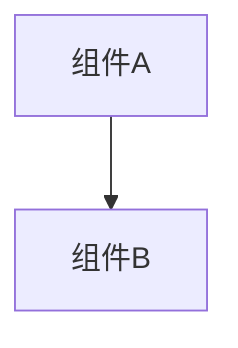

# 变更提案: ssh-tab-terminal-fit-recovery

## 元信息
```yaml
类型: 修复
方案类型: implementation
优先级: P1
状态: 已完成
创建: 2026-03-20
```

---

## 1. 需求

### 背景
SSH 工作区首次打开时终端与文件面板高度正常，但切换到其他标签再返回后，终端区域会被压缩到近似最小高度，出现“只剩一半”的显示异常。该问题直接影响终端可读性，也破坏了标签切换后的布局稳定性。

### 目标
- 修复 SSH 标签切换后终端区域被错误压缩的问题
- 保持现有上下分栏比例与拖拽行为，不扩散到其他终端类型
- 确保标签重新激活后，终端和文件面板都恢复到正确尺寸

### 约束条件
```yaml
时间约束: 本次仅处理 SSH 工作区切标签恢复问题
性能约束: 不引入高频轮询，仅在容器可见和标签激活时触发恢复
兼容性约束: 保持现有 SshWorkspace 分栏拖拽与 Terminal 组件接口不变
业务约束: 不重构整个标签系统或终端尺寸体系
```

### 验收标准
- [ ] SSH 标签首次打开后，终端与文件面板保持当前分栏比例
- [ ] 切换到其他标签再切回 SSH 标签后，终端不再缩成近似最小高度
- [ ] 现有分栏拖拽能力保持正常，终端仍能跟随尺寸变化刷新

---

## 2. 方案

### 技术方案
在 `SshWorkspace` 中补强工作区尺寸恢复逻辑：当工作区处于隐藏状态或容器高度无效时，跳过分栏高度同步，避免把终端高度错误钳制到最小值；当 SSH 标签重新激活时，在可见布局稳定后主动重新同步分栏高度，并派发一次窗口级 `resize` 事件，让内部 `Terminal` 重新执行 `fit`。

### 影响范围
```yaml
涉及模块:
  - ui-components: 修复 SSH 工作区隐藏恢复时的分栏高度同步与终端刷新链路
预计变更文件: 4
```

### 风险评估
| 风险 | 等级 | 应对 |
|------|------|------|
| 激活恢复时机过早，终端仍按旧尺寸 fit | 中 | 在标签激活后等待下一轮布局稳定再执行恢复 |
| 隐藏状态误判导致分栏不刷新 | 低 | 仅在容器高度无效时跳过同步，常规 ResizeObserver 路径保持不变 |
| 修复影响拖拽分栏体验 | 低 | 不修改拖拽逻辑，只补充隐藏与激活保护 |

---

## 3. 技术设计（可选）

> 涉及架构变更、API设计、数据模型变更时填写

### 架构设计


### API设计
#### {METHOD} {路径}
- **请求**: {结构}
- **响应**: {结构}

### 数据模型
| 字段 | 类型 | 说明 |
|------|------|------|
| {字段} | {类型} | {说明} |

---

## 4. 核心场景

> 执行完成后同步到对应模块文档

### 场景: SSH 标签恢复显示
**模块**: ui-components
**条件**: 用户已打开 SSH 工作区，并切换到其他标签后再返回
**行为**: 工作区重新变为活动状态时恢复分栏高度并刷新终端尺寸
**结果**: 终端区域保持正常高度，不再缩成近似最小值

---

## 5. 技术决策

> 本方案涉及的技术决策，归档后成为决策的唯一完整记录

### ssh-tab-terminal-fit-recovery#D001: 在 SshWorkspace 中修复标签恢复尺寸同步
**日期**: 2026-03-20
**状态**: ✅采纳
**背景**: 当前问题发生在 SSH 工作区上下分栏与终端 `fit` 的联动链路，需要决定是在局部工作区修复，还是重构整个终端尺寸恢复体系。
**选项分析**:
| 选项 | 优点 | 缺点 |
|------|------|------|
| A: 在 `SshWorkspace` 层修复隐藏与激活时的分栏同步 | 变更小，直接命中问题链路，风险可控 | 终端共享组件本身不感知标签恢复 |
| B: 重构 `Terminal` 全局尺寸恢复策略 | 可统一覆盖更多场景 | 范围扩大，容易影响本地终端与其他页面 |
**决策**: 选择方案A
**理由**: 这次只修 SSH 工作区场景，问题根源主要在分栏高度被隐藏状态错误重算；在 `SshWorkspace` 层补齐可见性保护和激活恢复，既能解决当前问题，也不会扩散到其他终端类型。
**影响**: 影响 `SshWorkspace` 的尺寸同步逻辑、方案包记录、知识库中的 UI 组件模块说明

---

## 6. 成果设计

> 含视觉产出的任务由 DESIGN Phase2 填充。非视觉任务整节标注"N/A"。

N/A（本次为布局恢复修复，无新增视觉设计产出）
