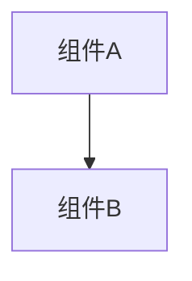

# 变更提案: tab-context-menu-ssh-actions

## 元信息
```yaml
类型: 新功能
方案类型: implementation
优先级: P1
状态: 已完成
创建: 2026-03-20
```

---

## 1. 需求

### 背景
当前顶部标签栏仅支持切换与关闭，缺少与 SSH 会话状态相关的快捷操作。用户希望在标签上直接右键完成连接、断开和批量关闭等动作，并要求菜单视觉与远程文件管理区现有右键菜单保持一致。

### 目标
- 为顶部标签栏增加右键菜单，并复用文件管理右键菜单的样式语言
- 支持“连接、连接全部、断开、关闭、关闭其他、关闭全部”六个动作
- 所有标签都能右键，但非 SSH 标签中的连接相关项置灰
- SSH 标签中已连接时禁用“连接”，已断开时禁用“断开”

### 约束条件
```yaml
时间约束: 本次只处理标签栏右键菜单与现有 SSH 标签状态联动
性能约束: 不引入全局轮询，SSH 连断状态仅通过标签数据驱动
兼容性约束: 保持现有 `a-tabs` 标签切换与关闭按钮行为
业务约束: 断开连接时保留 SSH 标签页，不自动关闭标签
```

### 验收标准
- [ ] 顶部所有标签都支持右键弹出菜单，样式与文件管理右键菜单一致
- [ ] 非 SSH 标签的“连接 / 连接全部 / 断开”置灰不可点击
- [ ] SSH 标签连接中禁用“连接”，断开后禁用“断开”并允许重新连接
- [ ] “关闭、关闭其他、关闭全部”可对各类标签正常生效
- [ ] `pnpm run build` 通过

---

## 2. 方案

### 技术方案
在 `TabManager` 中接入文件管理区已存在的 `FileContextMenu` 组件，基于当前右键目标标签和全部标签状态动态生成菜单项及禁用态；在 `App.vue` 中新增标签菜单动作分发，补充 SSH 标签的连接状态管理、手动断开保留标签逻辑，以及“关闭其他 / 关闭全部 / 连接全部”批量操作；在 `SshService` 和共享类型中补齐 SSH 标签状态和可失败重连行为。

### 影响范围
```yaml
涉及模块:
  - ui-components: 标签栏右键菜单与 SSH 标签状态展示
  - ssh-runtime: SSH 重连结果向上抛出，供标签菜单更新状态
预计变更文件: 6
```

### 风险评估
| 风险 | 等级 | 应对 |
|------|------|------|
| 手动断开后标签被退出事件误关闭 | 中 | 在 App 层记录手动断开中的标签，并把退出事件转为“更新为已断开” |
| 批量连接同时弹出多个密码交互 | 中 | `连接全部` 采用顺序重连，避免并发密码弹窗 |
| 右键菜单与标签点击事件冲突 | 低 | 右键菜单只拦截 `contextmenu`，不改动左键切换行为 |

---

## 3. 技术设计（可选）

> 涉及架构变更、API设计、数据模型变更时填写

### 架构设计


### API设计
#### {METHOD} {路径}
- **请求**: {结构}
- **响应**: {结构}

### 数据模型
| 字段 | 类型 | 说明 |
|------|------|------|
| {字段} | {类型} | {说明} |

---

## 4. 核心场景

> 执行完成后同步到对应模块文档

### 场景: 标签栏右键管理 SSH 会话
**模块**: ui-components
**条件**: 顶部工作区已有一个或多个标签，其中至少一个为 SSH 标签
**行为**: 用户右键标签后，根据标签类型和 SSH 连接状态执行连接、断开或关闭类动作
**结果**: 菜单项禁用态正确，断开保留标签，重新连接后状态恢复

---

## 5. 技术决策

> 本方案涉及的技术决策，归档后成为决策的唯一完整记录

### tab-context-menu-ssh-actions#D001: 复用文件管理右键菜单并在 App 层维护 SSH 标签状态
**日期**: 2026-03-20
**状态**: ✅采纳
**背景**: 标签栏新增右键动作时，需要决定是单独再写一套菜单样式，还是复用现有文件管理菜单；同时也需要决定 SSH 断开后是否关闭标签。
**选项分析**:
| 选项 | 优点 | 缺点 |
|------|------|------|
| A: 复用 `FileContextMenu`，在 App 层维护 SSH 标签状态 | 样式统一、改动集中、最符合现有结构 | 需要给标签数据补一层 SSH 状态 |
| B: 重新实现专用标签菜单，断开后直接关标签 | 实现更直接 | 与文件管理视觉不一致，且不满足“断开但保留标签”的需求 |
**决策**: 选择方案A
**理由**: 用户明确要求参考文件管理右键菜单样式，同时要求“已断开的不可点击断开、已连接的不能点击连接”，这意味着 SSH 标签需要有持久化的连接状态，最自然的落点就在 App 层标签数据。
**影响**: 影响 `TabManager`、`App.vue`、`SshService` 和标签共享类型定义

---

## 6. 成果设计

> 含视觉产出的任务由 DESIGN Phase2 填充。非视觉任务整节标注"N/A"。

N/A（本次为现有组件样式复用，无新增视觉方案）
