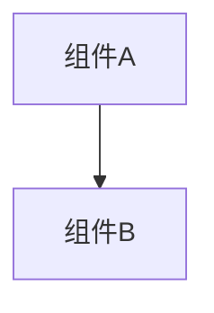

# 变更提案: ssh-disconnect-monitor-quiet-state

## 元信息
```yaml
类型: 修复
方案类型: implementation
优先级: P1
状态: 已完成
创建: 2026-03-20
```

---

## 1. 需求

### 背景
在标签栏右键新增“断开”后，SSH 标签会保留，但左侧嵌入监控和右侧系统监控仍继续按旧 `connectionId` 拉取系统信息，导致连接已断开后仍报出 “SSH连接不存在” 的错误提示。

### 目标
- SSH 断开后，系统监控立即停止轮询
- 监控面板保留外壳，但切换为“已断开”的静态状态
- 不再因为连接已不存在而弹出错误提示

### 约束条件
```yaml
时间约束: 本次仅修复断开后的监控停表与静态状态问题
性能约束: 断开后必须及时停止定时轮询，不保留空转刷新
兼容性约束: 保持已连接时的实时监控行为不变
业务约束: 断开后保留监控面板外壳，不自动收起
```

### 验收标准
- [ ] 断开 SSH 标签后，监控不再继续请求系统信息
- [ ] 断开后不再出现“SSH连接不存在”类错误 toast
- [ ] 监控面板显示“已断开 / 监控已停止刷新”的静态状态
- [ ] `pnpm run build` 通过

---

## 2. 方案

### 技术方案
在 `App.vue` 和 `SshWorkspace.vue` 中将监控使用的 `connectionId` 与 SSH 标签连接状态解耦，只在标签仍处于 `connected` 时向 `RightPanel` 传递有效连接；在 `RightPanel.vue` 中新增“监控已断开”判定，断开后禁用手动刷新、切换为静态断开文案，并在遇到“连接不存在/未找到”错误时静默停止轮询而不是继续报错。

### 影响范围
```yaml
涉及模块:
  - workspace-ui: 断开后的监控展示和轮询停止
预计变更文件: 5
```

### 风险评估
| 风险 | 等级 | 应对 |
|------|------|------|
| 断开后监控仍沿用旧静态摘要文案 | 低 | 调整摘要优先级，优先显示“连接已断开”说明 |
| 正常连接时误判为已断开 | 中 | 仅在存在 SSH profile 且 `connectionId` 为空时视为断开 |
| 停止轮询后仍残留一次在途请求报错 | 中 | 捕获“连接不存在”错误后静默 stopAutoRefresh |

---

## 3. 技术设计（可选）

> 涉及架构变更、API设计、数据模型变更时填写

### 架构设计


### API设计
#### {METHOD} {路径}
- **请求**: {结构}
- **响应**: {结构}

### 数据模型
| 字段 | 类型 | 说明 |
|------|------|------|
| {字段} | {类型} | {说明} |

---

## 4. 核心场景

> 执行完成后同步到对应模块文档

### 场景: SSH 断开后的监控静态态
**模块**: workspace-ui
**条件**: 当前 SSH 标签已手动断开，但标签页仍保留
**行为**: 系统监控停止轮询，刷新按钮禁用，摘要与状态胶囊切换为已断开文案
**结果**: 用户可看到静态断开状态，但不会再收到连接不存在的错误提示

---

## 5. 技术决策

> 本方案涉及的技术决策，归档后成为决策的唯一完整记录

### ssh-disconnect-monitor-quiet-state#D001: 监控连接状态跟随 SSH 标签状态失效
**日期**: 2026-03-20
**状态**: ✅采纳
**背景**: 右键断开 SSH 连接后标签仍保留，监控面板是否继续持有旧连接、是否自动收起，需要明确行为。
**选项分析**:
| 选项 | 优点 | 缺点 |
|------|------|------|
| A: 断开后清空监控使用的 `connectionId`，保留监控外壳并静态显示已断开 | 行为直观，停止轮询彻底，不影响标签保留 | 需要额外区分“标签存在”与“连接有效” |
| B: 断开后继续传旧连接，由监控内部报错重试 | 实现最少 | 会持续报错，体验差 |
| C: 断开后自动收起监控面板 | 能避免错误 | 不符合用户要求 |
**决策**: 选择方案A
**理由**: 用户明确希望“立即停止轮询并切成已断开静态状态，不再弹错误提示，保留当前面板壳子”，因此最合适的做法就是让监控链路与 SSH 连接状态直接同步失效。
**影响**: 影响 `App.vue`、`SshWorkspace.vue`、`RightPanel.vue` 和相关监控文案

---

## 6. 成果设计

> 含视觉产出的任务由 DESIGN Phase2 填充。非视觉任务整节标注"N/A"。

N/A（本次为监控行为修复，无新增视觉方案）
