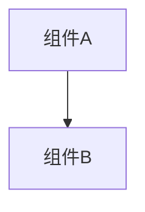

# 变更提案: ssh-disconnect-auto-reconnect-actions

## 元信息
```yaml
类型: 新功能
方案类型: implementation
优先级: P1
状态: 已完成
创建: 2026-03-20
```

---

## 1. 需求

### 背景
当前 SSH 标签断开后，虽然可以通过右键菜单手动重新连接，但终端里的回车和文件管理里的目录点击都不会自动触发重连，用户必须先右键连接再重新执行原操作，体验不连贯。

### 目标
- SSH 标签断开后，在终端按回车可自动触发重连
- SSH 标签断开后，点击文件管理中的文件夹可自动触发重连
- 重连成功后自动继续刚才那次回车或目录进入操作
- 重连失败时只提示失败，不继续原操作

### 约束条件
```yaml
时间约束: 本次只处理终端回车与文件管理目录点击两条断线恢复链路
性能约束: 不引入额外轮询，仅在用户触发操作时发起重连
兼容性约束: 保持现有手动“连接 / 断开”菜单和 SSH 标签状态机制
业务约束: 重连成功后自动续上原操作，失败则不继续
```

### 验收标准
- [ ] SSH 标签断开后，终端按回车会触发重连
- [ ] 重连成功后，终端会自动补发那次回车
- [ ] SSH 标签断开后，点击文件管理目录会触发重连
- [ ] 重连成功后，会自动进入原本点击的目录
- [ ] `pnpm run build` 通过

---

## 2. 方案

### 技术方案
将 SSH 标签连接状态继续下传到 `Terminal` 和 `RemoteFileWorkbench`：终端在断开状态下捕获用户回车，挂起一次待恢复回车并触发重连；文件管理在断开状态下捕获目录导航/打开动作，挂起一次待恢复导航并触发重连。待 App 层把 SSH 标签状态更新回 `connected` 后，子组件监听状态恢复，自动续上之前挂起的原操作。

### 影响范围
```yaml
涉及模块:
  - workspace-ui: 终端与文件管理的断线后自动重连交互
预计变更文件: 6
```

### 风险评估
| 风险 | 等级 | 应对 |
|------|------|------|
| 断线状态下重复触发重连 | 中 | 仅在 SSH 标签状态为 disconnected 时挂起动作并触发重连 |
| 重连成功后原操作重复执行 | 低 | 挂起动作在首次恢复后立即清空 |
| 终端补发回车时机过早 | 低 | 在连接状态恢复后延迟一个短时间再回写回车 |

---

## 3. 技术设计（可选）

> 涉及架构变更、API设计、数据模型变更时填写

### 架构设计


### API设计
#### {METHOD} {路径}
- **请求**: {结构}
- **响应**: {结构}

### 数据模型
| 字段 | 类型 | 说明 |
|------|------|------|
| {字段} | {类型} | {说明} |

---

## 4. 核心场景

> 执行完成后同步到对应模块文档

### 场景: 断线后自动恢复原操作
**模块**: workspace-ui
**条件**: SSH 标签已断开，用户在终端按回车或在文件管理中点击目录
**行为**: 组件先触发重连，连接恢复后自动继续原来的回车或目录导航
**结果**: 行为接近 FinalShell，用户无需先手动连接再重复操作

---

## 5. 技术决策

> 本方案涉及的技术决策，归档后成为决策的唯一完整记录

### ssh-disconnect-auto-reconnect-actions#D001: 在子组件内部挂起原操作，待 SSH 状态恢复后自动续执行
**日期**: 2026-03-20
**状态**: ✅采纳
**背景**: 断线后用户触发回车或目录点击时，需要决定是只做重连，还是在重连成功后自动继续原操作。
**选项分析**:
| 选项 | 优点 | 缺点 |
|------|------|------|
| A: 组件内部挂起原操作，连接恢复后自动续上 | 最贴近 FinalShell 体验，用户动作最少 | 需要多组件共享 SSH 状态 |
| B: 只自动重连，不自动继续原操作 | 实现简单 | 用户仍需再按一次回车或再点一次目录 |
**决策**: 选择方案A
**理由**: 用户明确要求“重连成功后自动继续刚才那次操作”，因此应由触发操作的子组件保存挂起动作，并在 SSH 状态恢复后自行续执行。
**影响**: 影响 `Terminal.vue`、`RemoteFileWorkbench.vue`、`SshWorkspace.vue` 和 `App.vue`

---

## 6. 成果设计

> 含视觉产出的任务由 DESIGN Phase2 填充。非视觉任务整节标注"N/A"。

N/A（本次为交互行为增强，无新增视觉方案）
