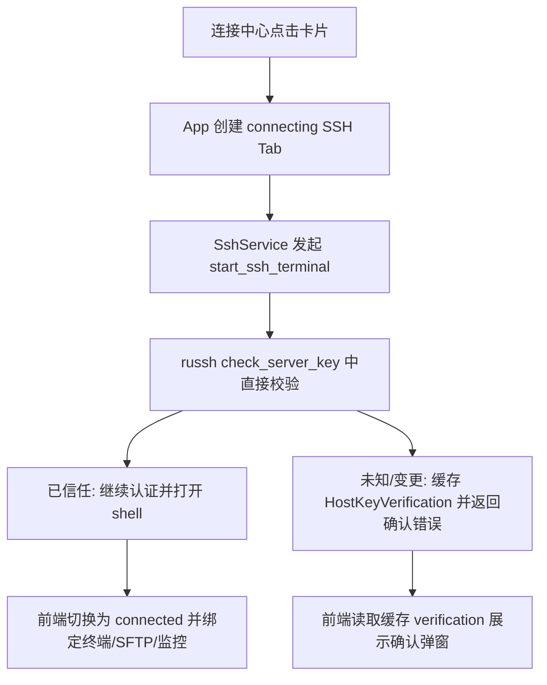

# 变更提案: ssh-connect-lag-investigation

## 元信息
```yaml
类型: 优化
方案类型: implementation
优先级: P1
状态: 已完成
创建: 2026-03-22
```

---

## 1. 需求

### 背景
连接中心中点击已保存 SSH 连接时，界面会明显停顿约 1-2 秒后才进入工作区，用户感知像“点了没反应”。排查发现卡顿同时来自前端和后端两层：

- 前端在 `App.vue` 中等待 `SshService.launchProfile()` 完成后才创建 SSH 标签页，导致整个点击反馈被 SSH 建连耗时阻塞。
- Rust 侧 `connect_authenticated_session()` 在正式建连前会先额外执行一次 `preview_host_key()` 临时 SSH 握手，即使主机密钥已信任也会串行多走一轮网络握手。

### 目标
- 点击连接卡片后立即打开 SSH 标签页，先给出明确的“连接中”反馈。
- 将已信任主机的 SSH 建连从“双握手”收敛为“单握手”。
- 保持现有主机密钥校验与用户确认流程，不以安全换性能。

### 约束条件
```yaml
时间约束: 本轮直接在现有 Vue 3 + Tauri + russh 链路上修复，不引入新依赖
性能约束: 不能新增高频轮询或额外 IPC，需减少握手次数与无效 UI 阻塞
兼容性约束: 需兼容现有 host key trust/preview/save 决策流和 SSH 断线重连能力
业务约束: 连接中心、终端、远程文件工作台、监控面板的状态判断必须保持一致
```

### 验收标准
- [x] 连接中心点击已保存连接时，SSH 标签页会先以 `connecting` 状态立即出现，不再等待建连成功后才创建。
- [x] 已信任主机的 `start_ssh_terminal` 不再在正式连接前额外执行一次 `preview_host_key` 握手。
- [x] 未信任或主机密钥变化时，前端仍能展示完整指纹确认信息，且不再因为重复 preview 额外增加一轮网络连接。
- [x] `pnpm run build` 与 `cargo check --manifest-path src-tauri/Cargo.toml` 通过。

---

## 2. 方案

### 技术方案
本次采用“双层优化”：

1. 前端引入 `connecting` 中间态。
   `App.vue` 在点击连接卡片后先创建 SSH tab 并切到活动态，再异步执行实际建连。`Terminal.vue`、`RemoteFileWorkbench.vue`、`TabManager.vue`、`SshWorkspace.vue` 统一识别该状态，避免在连接未就绪时抢先绑定会话、加载 SFTP 或启动监控。

2. 后端将主机密钥校验并入正式握手。
   `ssh_auth.rs` 改为在 `russh::client::Handler::check_server_key` 中直接构造 `HostKeyVerification`，把“是否需要用户确认”的结果写入共享缓存。`connect_authenticated_session()` 不再先调用 `preview_host_key()`；若遇到未知/变更主机密钥，则直接复用本次握手捕获到的验证结果供前端展示。

### 影响范围
```yaml
涉及模块:
  - app-shell: App 层 SSH tab 的创建时机与右侧监控 connectionId 下发条件
  - ui-components: Terminal/TabManager/RemoteFileWorkbench/SshWorkspace 的连接中状态处理
  - ssh-runtime: host key 校验、pending verification 缓存、正式 SSH 握手流程
预计变更文件: 8
```

### 风险评估
| 风险 | 等级 | 应对 |
|------|------|------|
| `connecting` 状态遗漏导致子组件误把未就绪连接当已连接使用 | 中 | 统一收口为仅 `connected` 才允许 SFTP/监控/实时会话绑定 |
| host key 逻辑并入握手后丢失确认弹窗所需信息 | 中 | 在 Rust 侧增加 pending verification 缓存，`preview_host_key` 优先读缓存 |
| reconnect/close 等旧链路受新状态影响 | 中 | 保持 `disconnected` 语义不变，并通过前端构建与 Rust 编译验证 |

---

## 3. 技术设计

### 架构设计


### 数据模型
| 字段 | 类型 | 说明 |
|------|------|------|
| `ConnectionTab.sshState` | `'connecting' \| 'connected' \| 'disconnected'` | SSH 标签页的三态连接状态 |
| `PENDING_HOST_KEY_VERIFICATIONS` | `HashMap<String, HostKeyVerification>` | 按 `connection_id` 暂存本次握手中产生的 host key 校验结果 |

---

## 4. 核心场景

### 场景: 连接中心点击已信任主机
**模块**: app-shell / ssh-runtime
**条件**: 已保存 SSH profile，host key 已受信任
**行为**: 用户点击连接卡片
**结果**: UI 立即打开 `connecting` tab，后端只走一次正式 SSH 握手，连接完成后切换为 `connected`

### 场景: 连接中心点击未知主机
**模块**: ssh-runtime
**条件**: 首次连接或主机密钥变化
**行为**: 正式握手阶段捕获 host key 校验结果并返回确认错误
**结果**: 前端直接读取缓存的 verification 数据展示指纹确认弹窗，无需再额外发起 preview 连接

---

## 5. 技术决策

### ssh-connect-lag-investigation#D001: 保留 host key 安全校验，但把校验并入正式握手
**日期**: 2026-03-22
**状态**: ✅采纳
**背景**: 连接中心卡顿的主要原因是每次点击都会先做一次 `preview_host_key()` 再做正式连接，已信任主机也无法跳过。
**选项分析**:
| 选项 | 优点 | 缺点 |
|------|------|------|
| A: 直接关闭严格 host key 校验 | 实现最简单，速度最快 | 安全退化，不可接受 |
| B: 在正式握手的 `check_server_key` 中完成校验，并缓存确认信息 | 同时保留安全与性能，已信任主机只需一次握手 | 需要补充 pending verification 状态管理 |
**决策**: 选择方案 B
**理由**: 这是唯一同时满足“减少握手次数”和“保持主机密钥确认能力”的方案。
**影响**: 影响 `src-tauri/src/ssh_auth.rs`、`src/services/SshService.ts` 与 SSH 工作区相关组件的状态流转

---

## 6. 成果设计

> 本次为运行时性能与交互优化，无新增视觉方案。

N/A
