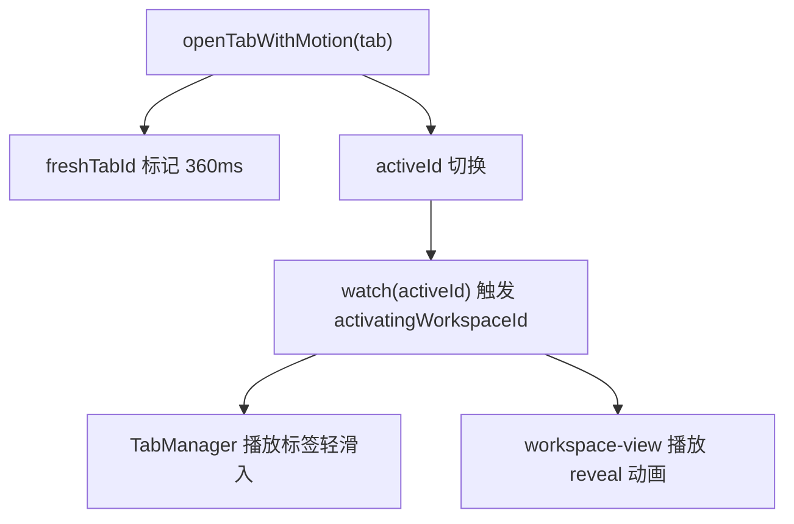

# 变更提案: ssh-tab-open-motion

## 元信息
```yaml
类型: 优化
方案类型: implementation
优先级: P2
状态: 已完成
创建: 2026-03-22
```

---

## 1. 需求

### 背景
SSH 连接中心的首击卡顿已经修复，但从连接中心进入 SSH 工作区时，标签和内容区仍然是“瞬间切换”，体感偏硬，缺少过渡感。

### 目标
- 让新开的 tab 标签有轻盈的滑入感。
- 让工作区切换有短促、顺滑、不打断操作的进入动效。
- 保持终端响应优先，不引入重 JS 动画或大面积布局抖动。

### 约束条件
```yaml
时间约束: 基于现有 Vue + CSS 结构做增量优化
性能约束: 优先 transform/opacity/filter，避免持续重排
兼容性约束: 不改 TabManager 的交互语义，不影响 SSH connecting/disconnected 状态逻辑
业务约束: 动效时长需控制在 180-260ms 区间，风格偏轻盈克制
```

### 验收标准
- [x] 新建 tab 时标签内容有轻微滑入与淡入效果。
- [x] 切换到新工作区时，内容区有短促的淡入+上浮过渡，而不是硬切。
- [x] 动效不影响 `pnpm run build` 通过，也不改变现有 SSH 连接逻辑。

---

## 2. 方案

### 技术方案
- 在 `App.vue` 增加两个短生命周期状态：
  - `freshTabId` 用于标记刚创建的 tab。
  - `activatingWorkspaceId` 用于标记当前需要播放进入动画的工作区。
- 统一通过 `openTabWithMotion()` 打开新 tab，让本地终端、连接中心、文件预览和 SSH 标签都复用同一套轻动画入口。
- `TabManager.vue` 侧开启 `inkBar` 动画，并为新 tab 内容增加一次性 `tab-content-arrive` 动画。
- `App.vue` 中为 `.workspace-view` 增加一次性 reveal 动画和很淡的高光扫过层，让内容切换像“接住”而不是瞬移。

### 影响范围
```yaml
涉及模块:
  - app-shell: Tab 打开与工作区切换的统一动效入口
  - ui-components: TabManager 标签条的动效呈现
预计变更文件: 2
```

### 风险评估
| 风险 | 等级 | 应对 |
|------|------|------|
| 动效重复触发导致闪动 | 中 | 用定时器和 requestAnimationFrame 收口成一次性瞬时状态 |
| 对终端性能造成影响 | 低 | 仅使用短时 transform/opacity/filter，不做持续动画 |

---

## 3. 技术设计

### 架构设计


### 数据模型
| 字段 | 类型 | 说明 |
|------|------|------|
| `freshTabId` | `string` | 当前正在播放“新标签进入”动效的 tab id |
| `activatingWorkspaceId` | `string` | 当前正在播放“工作区切换”动效的 tab id |

---

## 4. 核心场景

### 场景: 从连接中心打开 SSH 标签
**模块**: app-shell / ui-components
**条件**: 用户点击连接卡片
**行为**: 新 SSH tab 被创建并切换为活动态
**结果**: 标签轻微滑入，工作区内容有短促淡入和上浮，整体切换更顺滑

### 场景: 打开文件预览或本地终端
**模块**: app-shell
**条件**: 用户打开新 tab
**行为**: 通过统一 `openTabWithMotion` 进入
**结果**: 新 tab 也复用同一套轻量动效，避免只有 SSH 标签有过渡

---

## 5. 技术决策

### ssh-tab-open-motion#D001: 采用短时 CSS reveal，而不是复杂 Transition 组件重构
**日期**: 2026-03-22
**状态**: ✅采纳
**背景**: 现有工作区通过 `v-show + absolute` 管理多个 tab 视图，若改成复杂的 Transition 包裹，容易碰到终端组件挂载/解绑与尺寸同步问题。
**选项分析**:
| 选项 | 优点 | 缺点 |
|------|------|------|
| A: 重构为完整的 Vue Transition 结构 | 语义更完整 | 改动大，容易影响终端/SFTP 生命周期 |
| B: 保持现有结构，用短生命周期 class 做 reveal 动效 | 改动小、风险低、足够顺滑 | 需要手动维护一次性状态 |
**决策**: 选择方案 B
**理由**: 当前需求是“让切换更丝滑”，不是重做整个 tab 生命周期；增量 CSS reveal 是更稳妥的路径。
**影响**: 影响 `src/App.vue` 和 `src/components/TabManager.vue`

---

## 6. 成果设计

### 设计方向
- **美学基调**: 轻盈玻璃感过渡，不做夸张位移，像界面被轻轻推开
- **记忆点**: 新工作区出现时会有一层极淡的高光掠过，像内容被“点亮”一下
- **参考**: macOS 原生窗口切换中偏克制的 motion 语言

### 视觉要素
- **配色**: 复用现有界面高光白和主色系蓝色，不新增突兀强调色
- **字体**: 沿用现有项目字体体系
- **布局**: 不改布局，只在已有块级容器上做 reveal
- **动效**: 220-240ms，主要靠 opacity + translateY + scale 的组合
- **氛围**: 通过极淡的高光扫层增加“丝滑打开”的感知

### 技术约束
- **可访问性**: 保持短时、低强度，避免明显眩晕感
- **响应式**: 动效不依赖视口尺寸，桌面与窄屏统一生效
