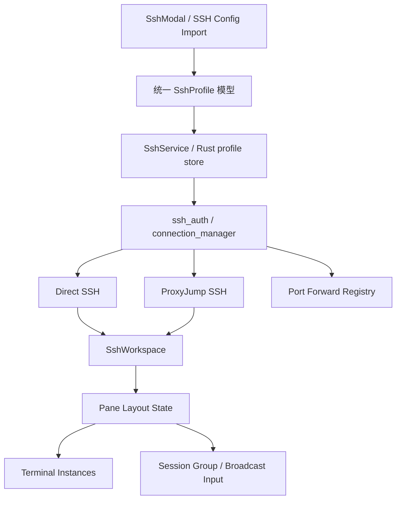

# 变更提案: advanced-ssh-workflow-foundation

## 元信息
```yaml
类型: 新功能/重构/优化
方案类型: implementation
优先级: P0
状态: 进行中
创建: 2026-03-22
```

---

## 1. 需求

### 背景
`Termlink` 现阶段已经具备 SSH 连接、远程文件工作台、系统监控、连接中心和导入导出能力，足以支撑单机会话的远程运维场景。但如果要从“可用的终端工具”升级到“高频使用的远程工作台”，当前有三类明显短板：

- 高级 SSH 能力不足，缺少 `ProxyJump/堡垒机`、端口转发和 `~/.ssh/config` 导入。
- 多会话效率不足，缺少分屏、会话编组和广播输入，无法高效处理多台机器的协同巡检与批量执行。
- 产品完成度不足，文件下载位置仍为默认路径拼接，冷启动和首屏代码体积偏大，关键路径回归缺少结构化覆盖。

### 目标
- 在不推翻现有 `connection_id` 共享模型的前提下，扩展 SSH 配置和连接能力，支持 `ProxyJump`、本地端口转发和 `SSH config` 导入。
- 将当前“单 tab 单工作区”的 SSH 体验扩展为“支持分屏和会话组”的多会话工作台，并提供可控的广播输入。
- 把文件选择、性能和验证链补到一个更像桌面产品的完成度水平，减少“功能存在但交付感不足”的问题。

### 约束条件
```yaml
时间约束: 本轮直接在现有 Vue 3 + Tauri 2 + Rust 架构上演进，不重做终端或连接管理底层
性能约束: 不允许引入高频无意义轮询；新增会话编组和广播能力后仍需保持终端输入链和 SFTP 懒加载路径轻量
兼容性约束: 需兼容现有 SSH profile、host key trust、SFTP/监控共享 connection_id 模型
业务约束: 优先补齐高频生产力能力，不在本轮扩展 Telnet/RDP/VNC 等协议
```

### 验收标准
- [ ] `SshProfile` 与 SSH 连接表单支持 `ProxyJump`、端口转发、`SSH config` 导入所需的最小字段，并可在 UI 中配置和保存。
- [ ] 后端 SSH 建连链路支持通过跳板机建立 SSH 终端，且保留现有 host key 校验与错误提示语义。
- [ ] UI 支持在同一 SSH 标签页内创建分屏终端，并能将多个连接加入会话组后执行广播输入。
- [ ] 文件下载/上传相关流程可调用真实系统文件选择器，不再仅依赖默认下载目录推断。
- [ ] 启动性能完成至少一轮可量化优化，前端构建告警和首屏重资源点被收敛或明确隔离。
- [ ] 关键路径回归脚本/测试覆盖以下主链路：保存并发起高级 SSH 连接、`SSH config` 导入、分屏与广播输入、真实文件选择器调用。
- [ ] `pnpm run build` 与 `cargo check --manifest-path src-tauri/Cargo.toml` 通过，新增测试命令可运行。

---

## 2. 方案

### 技术方案
采用“基础设施先行”的分层改造方案，先统一 SSH 能力描述和工作区编排模型，再挂载具体功能。

1. 连接模型统一扩展  
   在前端 `SshProfile/SshConnectionPayload`、表单、导入导出和 Rust 侧 profile 存储结构中补充 `ProxyJump`、端口转发和 `SSH config` 来源描述字段，为后续建连和导入逻辑提供一致的输入。

2. SSH 运行时能力增强  
   Rust 侧在现有 `ssh_auth / connection_manager / ssh_terminal_russh` 链路上补充跳板机建连和端口转发生命周期管理；前端通过高级配置表单和状态提示接入，不新增分离的第二套 SSH 管理流程。

3. 工作区编排升级  
   在现有 `App.vue + TabManager + SshWorkspace + Terminal` 结构上引入“一个 SSH 标签页可包含多个 pane、多个 pane 可属于同一广播组”的状态模型，优先保证输入广播和 pane 生命周期正确，再叠加布局与交互。

4. 完成度补强  
   使用真实文件选择器替换当前默认路径推断；对首屏重资源（Monaco、监控、连接中心衍生 chunk）继续做延迟加载与分包；补充可自动执行的关键路径回归。

### 影响范围
```yaml
涉及模块:
  - app-shell: 顶层 tab/workspace 状态、分屏和会话组编排
  - ssh-profile-ui: SSH 表单、高级设置、导入导出
  - ssh-runtime: 跳板机建连、端口转发、SSH config 解析
  - terminal-runtime: pane 实例、广播输入、终端生命周期
  - file-transfer: 真实文件选择器和下载/上传选择流程
  - build-and-test: 前端分包、回归脚本与验证
预计变更文件: 16-24
```

### 风险评估
| 风险 | 等级 | 应对 |
|------|------|------|
| 扩展 profile 结构后导入导出和历史配置兼容性出问题 | 高 | 新字段全部做可选兼容，导入时提供默认值并保留旧结构读取能力 |
| 分屏和广播输入让终端输入流错发到错误 pane | 高 | 先建立 pane/session group 的显式目标模型，广播默认关闭，发送前明确目标集合 |
| 跳板机连接破坏现有 host key/认证流程 | 中 | 复用现有认证和 host key 校验逻辑，仅扩展前置连接路径，不新增旁路 |
| 端口转发生命周期泄漏导致断连后残留资源 | 中 | 将转发句柄绑定到 `connection_id` 生命周期，在 disconnect/reconnect 时统一清理 |
| 性能优化与功能改动并行导致定位困难 | 中 | 先完成功能正确性，再对大块资源和初始化链路做独立优化与验证 |

---

## 3. 技术设计

### 架构设计


### 数据模型
| 字段 | 类型 | 说明 |
|------|------|------|
| `proxyJump` | `string` | 跳板机引用，支持 `user@host:port` 文本或引用已保存连接 |
| `portForwards` | `Array<{id, type, localPort, remoteHost, remotePort}>` | 本地端口转发配置 |
| `sshConfigSource` | `string \| null` | 导入来源标记，便于追踪是否来自 `~/.ssh/config` |
| `SshPane` | `{id, connectionId, title, broadcastEnabled}` | SSH 工作区中的终端 pane |
| `SessionGroup` | `{id, name, paneIds}` | 广播输入与会话编组模型 |

---

## 4. 核心场景

### 场景: 通过堡垒机打开 SSH 工作区
**模块**: ssh-profile-ui / ssh-runtime
**条件**: 用户在连接配置中填写 `ProxyJump`
**行为**: 从连接中心发起 SSH 连接
**结果**: 后端先建立跳板机会话，再打开目标主机终端，工作区其余功能保持一致

### 场景: 从 `~/.ssh/config` 导入已有主机
**模块**: ssh-profile-ui / import-export
**条件**: 本地存在 SSH config 文件
**行为**: 用户在设置或连接入口中触发导入
**结果**: 解析出主机条目并映射到可保存的连接配置，用户可选择导入全部或部分条目

### 场景: 在同一 SSH 标签页中做分屏巡检
**模块**: app-shell / terminal-runtime
**条件**: 用户已打开一个 SSH 工作区
**行为**: 新建分屏 pane，并将多个 pane 加入同一会话组
**结果**: 用户可以同时观察多个终端 pane，并按需切换是否广播输入

### 场景: 下载远程文件时选择真实目标位置
**模块**: file-transfer
**条件**: 用户在远程文件工作台或编辑器中触发下载
**行为**: 调用系统文件保存对话框
**结果**: 返回用户明确选择的本地路径，并继续现有下载流程

---

## 5. 技术决策

### advanced-ssh-workflow-foundation#D001: 先统一连接与工作区状态模型，再挂载功能
**日期**: 2026-03-22
**状态**: ✅采纳
**背景**: 本轮需求横跨高级 SSH、分屏广播和产品完成度，若直接逐个加入口，后续会在 profile 结构、pane 状态和运行时能力上出现重复逻辑。
**选项分析**:
| 选项 | 优点 | 缺点 |
|------|------|------|
| A: 先统一底层状态模型，再分层接入功能 | 后续扩展稳，避免返工，运行时状态更清晰 | 首轮设计和实现量更大 |
| B: 先按功能逐个叠加 | 感知交付更快 | 容易产生两套连接配置与会话管理逻辑 |
**决策**: 选择方案 A
**理由**: 本轮需求的耦合度高，只有先统一模型，才能让 `ProxyJump`、分屏、广播和测试回归使用同一套语义。
**影响**: 影响前端类型、SSH 表单、Rust profile store、工作区状态与测试结构

### advanced-ssh-workflow-foundation#D002: 广播输入默认显式开启，而不是自动跟随会话组
**日期**: 2026-03-22
**状态**: ✅采纳
**背景**: 多主机广播输入是高风险效率能力，一旦默认开启，容易把命令误发到非预期主机。
**选项分析**:
| 选项 | 优点 | 缺点 |
|------|------|------|
| A: 进入会话组即自动广播 | 操作快 | 风险高，容易误操作 |
| B: 会话组仅组织 pane，广播需用户显式开启 | 更安全，符合运维场景习惯 | 多一步操作 |
**决策**: 选择方案 B
**理由**: 在桌面 SSH 产品里，安全优先于少点一次按钮。
**影响**: 影响 pane 工具条、会话组状态和终端输入分发逻辑

---

## 6. 成果设计

### 设计方向
- **美学基调**: 延续现有深色运维工作台语言，在不打断当前主界面结构的前提下增加“高级能力可见但不喧宾夺主”的控制层
- **记忆点**: SSH 工作区顶部的 pane/group 控制条，能明确看到“当前 pane / 当前组 / 广播状态”
- **参考**: 现有 Termlink 工作区风格 + MobaXterm/Xshell 的效率导向信息密度

### 视觉要素
- **配色**: 保持当前蓝色强调色体系，广播开启使用琥珀色/橙色高显著提示，避免与普通激活态混淆
- **字体**: 延续现有终端和系统字体配置，不引入新的字体栈
- **布局**: 高级 SSH 配置采用可折叠分区；分屏工具条放在 SSH 工作区头部或 pane 顶部，避免侵占主终端区域
- **动效**: 分屏创建与切换采用轻量滑入/淡入动效，广播状态切换采用高对比提示而非复杂动画
- **氛围**: 维持现有工作台的低噪音背景和信息卡片体系，新增状态只在关键位置强化

### 技术约束
- **可访问性**: 广播输入、端口转发和文件选择器入口需有明确文案和可区分状态
- **响应式**: 以桌面端为主，分屏最小宽度受控，小屏时退化为纵向堆叠或限制新增 pane
