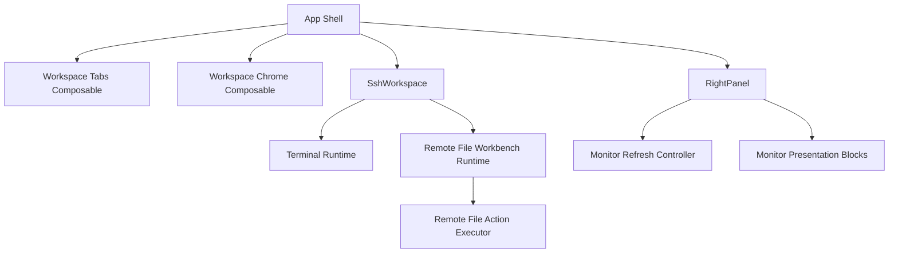

# 变更提案: frontend-workspace-runtime-refactor

## 元信息
```yaml
类型: 重构/优化
方案类型: implementation
优先级: P0
状态: 进行中
创建: 2026-03-22
```

---

## 1. 需求

### 背景
当前前端主工作区链路已经叠加了 SSH 工作区、终端会话、系统监控、远程文件工作台、传输面板和标签页编排，但这些能力主要堆叠在少数超大组件中：

- [`src/App.vue`](/Users/mengjia/WebstormProjects/Termlink/src/App.vue) 同时承担应用壳层、标签页资源管理、连接编排、文件预览入口和多处 UI 状态控制。
- [`src/components/RightPanel.vue`](/Users/mengjia/WebstormProjects/Termlink/src/components/RightPanel.vue) 同时承担监控仪表盘、传输队列、轮询控制、主题监听和大量格式化逻辑。
- [`src/components/RemoteFileWorkbench.vue`](/Users/mengjia/WebstormProjects/Termlink/src/components/RemoteFileWorkbench.vue) 内部同时处理目录加载、选择、拖拽、重命名、权限、下载上传、上下文菜单和日志。
- [`src/components/Terminal.vue`](/Users/mengjia/WebstormProjects/Termlink/src/components/Terminal.vue) 同时包含 xterm 初始化、SSH/PTY 会话绑定、目录探测、右键菜单和多种副作用管理。

这导致几个已经暴露出来的实质问题：

- 隐藏工作区仍保留终端实例和事件订阅，后台持续消费 SSH/PTY 数据。
- 系统监控在用户不看监控面板时仍会持续刷新和计算。
- 文件操作流程大量重复，逻辑分散，难以复用和验证。
- 组件职责边界过宽，任何新功能都更容易把复杂度继续堆高。

### 目标
- 重构主工作区前端编排，使壳层、运行时、副作用和展示职责分离。
- 修复隐藏工作区持续消费会话事件、监控面板无效轮询等性能问题。
- 将远程文件工作台中的重复文件操作流程抽离成统一执行路径，减少重复代码。
- 让超大组件拆分为更清晰的展示块和运行时控制层，后续能力可以在现有架构上继续演进。
- 保持现有产品功能、视觉方向和技术栈不变，不引入新的状态库或重做全项目。

### 约束条件
```yaml
时间约束: 本轮聚焦主工作区链路，不扩展新业务能力
性能约束: 必须收掉隐藏工作区和非激活监控的无效订阅、轮询和重复渲染
兼容性约束: 保持现有 SSH、分屏、广播输入、远程文件、传输队列和监控行为可用
业务约束: 不更换 Vue 3 + Tauri + antdv-next + xterm 现有技术栈，不引入 Pinia 等新的全局状态层
```

### 验收标准
- [ ] 标签页切换后，非激活工作区不再持续绑定终端输出流或无意义执行 `fit / resize / write` 路径。
- [ ] 监控刷新仅在监控面板实际可见且连接可用时启动，切换到下载面板或折叠后会停止。
- [ ] `App.vue`、`RightPanel.vue`、`RemoteFileWorkbench.vue`、`Terminal.vue` 至少完成一轮明确职责拆分，主文件体量和认知负担显著下降。
- [ ] 远程文件工作台中的重命名、创建、删除、移动、权限修改等操作不再各自维护一套重复的刷新与提示流程。
- [ ] 清理当前链路中的无效状态、重复 watcher 和未使用逻辑，不引入行为回归。
- [ ] `pnpm run build` 通过。

---

## 2. 方案

### 技术方案
采用“工作区编排重构优先”的分层方案，在不更换技术栈的前提下重组主工作区前端结构：

1. 壳层编排收口  
   将顶层 `App.vue` 收敛为“标签页装配 + 全局 chrome + 高层事件路由”，把标签页资源释放、工作区可见性、连接中心与 SSH 工作区的桥接逻辑继续下沉到 composables / 子组件。

2. 工作区运行时下沉  
   以 SSH 工作区为核心，把终端会话可见性、分屏 pane 生命周期、文件抽屉行为和布局恢复逻辑收拢为更清晰的运行时层，避免多个 watcher 各自驱动同一副作用。

3. 终端会话按激活状态治理  
   重构 `Terminal.vue` 的会话绑定策略，让 SSH/PTY 订阅、尺寸同步和上下文菜单逻辑按激活状态与连接状态分层，减少隐藏实例的后台开销。

4. 监控面板解耦  
   把 `RightPanel` 中监控相关的轮询控制、数据派生和展示块拆开，让“何时刷新”与“怎么展示”分离，并显式依赖面板可见性。

5. 文件工作台操作统一  
   抽取远程文件操作执行器，把创建、重命名、删除、移动、权限修改、所有者修改等流程统一成“执行命令 -> 刷新 -> tree 同步 -> 审计日志 -> 反馈”的标准路径。

### 影响范围
```yaml
涉及模块:
  - app-shell: 顶层工作区与标签页装配逻辑收敛
  - ui-components: RightPanel、SshWorkspace、RemoteFileWorkbench、Terminal 组件拆分
  - composables: 新增或重构工作区可见性、监控轮询、文件操作执行逻辑
  - utilities: 提取共享运行时工具与文件操作辅助函数
预计变更文件: 10-16
```

### 风险评估
| 风险 | 等级 | 应对 |
|------|------|------|
| 工作区生命周期重构后导致 SSH/PTY 清理或重连时机出错 | 高 | 先围绕现有行为重组边界，不改协议与底层服务接口；实现后用构建和手工链路重点复核 |
| `RightPanel` 拆分时误伤下载管理链路 | 中 | 保持传输管理逻辑接口不变，优先抽监控展示和刷新控制 |
| 文件工作台操作抽象过度，反而增加理解成本 | 中 | 只抽统一执行路径和共享副作用，不引入新的泛化状态机 |
| 大文件拆分后样式或事件透传出现遗漏 | 中 | 保持 props / emits 语义稳定，先做内部重组，再跑构建检查 |

---

## 3. 技术设计

### 架构设计


### 数据模型
| 字段 | 类型 | 说明 |
|------|------|------|
| `WorkspaceVisibility` | `{ active: boolean; mounted: boolean }` | 用于区分工作区是否显示、是否需要保持实例 |
| `RemoteFileActionContext` | `{ connectionId, currentPath, refresh, refreshTree, audit }` | 远程文件操作统一执行所需上下文 |
| `MonitorRefreshState` | `{ visible, connectionReady, collapsed, activeTab }` | 控制监控轮询是否启动的最小状态集合 |

---

## 4. 核心场景

### 场景: 切换标签页后的 SSH 工作区静默
**模块**: app-shell / terminal-runtime
**条件**: 用户打开多个本地或 SSH 标签页并切换
**行为**: 非激活工作区停止终端输出消费与无效尺寸恢复
**结果**: 工作区切换不再让隐藏终端持续消耗渲染和事件开销

### 场景: 监控仅在可见时刷新
**模块**: ui-components
**条件**: 用户在 SSH 标签页中切换监控与下载面板，或折叠右侧区域
**行为**: 监控刷新控制器根据可见性和连接状态启动或停止轮询
**结果**: 监控数据只在真正需要时刷新

### 场景: 远程文件操作统一执行
**模块**: ui-components / utilities
**条件**: 用户在远程文件工作台内执行创建、重命名、删除、移动、权限修改等操作
**行为**: 各操作走统一执行路径并共享刷新、树同步、审计与提示逻辑
**结果**: 逻辑集中且可复用，组件脚本复杂度下降

---

## 5. 技术决策

### frontend-workspace-runtime-refactor#D001: 优先重构工作区编排边界，而不是仅做文件级拆分
**日期**: 2026-03-22
**状态**: ✅采纳
**背景**: 这次 review 中最严重的问题不是“文件太长”本身，而是工作区可见性、终端订阅、监控轮询和文件工作台副作用都混在少数组件里，导致性能问题与职责问题互相缠绕。
**选项分析**:
| 选项 | 优点 | 缺点 |
|------|------|------|
| A: 先重构工作区编排和生命周期边界 | 能同时解决职责与性能问题，后续扩展更稳 | 改动面更大 |
| B: 只拆超大文件 | 文件会变短，改动更聚焦 | 后台无效订阅与编排混乱问题只能部分缓解 |
**决策**: 选择方案 A
**理由**: 只有先把“谁负责启动、暂停、销毁副作用”理顺，拆文件才有意义，否则只是把复杂度分散到更多文件里。
**影响**: 影响 `App.vue`、`SshWorkspace.vue`、`Terminal.vue`、`RightPanel.vue`、`RemoteFileWorkbench.vue` 及相关 composables

### frontend-workspace-runtime-refactor#D002: 文件工作台只抽统一执行器，不引入新的全局状态中心
**日期**: 2026-03-22
**状态**: ✅采纳
**背景**: 远程文件工作台内部操作很多，但当前问题更多是执行流程重复，而不是状态共享缺失。
**选项分析**:
| 选项 | 优点 | 缺点 |
|------|------|------|
| A: 抽统一操作执行器 | 直接减少重复，成本可控，保留现有组件结构 | 仍保留局部状态在组件内部 |
| B: 重做完整 store/状态机 | 理论边界更纯粹 | 成本高，容易超出本轮边界 |
**决策**: 选择方案 A
**理由**: 本轮目标是“最优改动”解决已识别问题，而不是把文件工作台重写成另一套基础设施。
**影响**: 影响 `RemoteFileWorkbench.vue` 及相关工具/组合式函数

---

## 6. 成果设计

N/A。本次以结构重构和性能治理为主，保留现有界面视觉语言，仅在组件拆分过程中维持当前的桌面终端工具风格与交互密度。
