# Termlink

一个基于 Tauri 2.x + Vue 3 + Rust 构建的现代化 MobaXterm 风格终端管理工具。提供 SSH 终端会话、SFTP 文件管理、远程系统监控和下载管理功能，支持跨平台桌面应用。

## 项目愿景

Termlink 旨在提供一个轻量级、高性能的跨平台终端管理工具，集成 SSH 连接、文件传输、系统监控等功能，为开发者和运维人员提供便捷的远程服务器管理体验。

## 架构总览

Termlink 采用 **Tauri 2.x 混合架构**：

- **前端 (Vue 3 + Vite)**: 使用 Ant Design Vue Next 组件、xterm.js 终端模拟器和 Monaco Editor 文件编辑器渲染 UI。通过 Tauri 的 `invoke()` IPC 机制与后端通信。
- **后端 (Rust)**: 处理所有系统级操作，包括本地 PTY 管理 (`portable-pty`)、SSH 连接 (`russh`)、SFTP 文件传输 (`russh-sftp`)、凭证存储 (`keyring`) 和远程系统监控（通过 SSH 命令执行）。
- **IPC 层**: Tauri 命令系统桥接前后端。命令在 `src-tauri/src/lib.rs` 中注册，从 TypeScript 通过 `@tauri-apps/api/core` 调用。

### 模块结构图

```mermaid
graph TD
    A["(根) Termlink"] --> B["src (前端 - Vue 3 + TypeScript)"];
    A --> C["src-tauri (后端 - Rust)"];

    B --> D["components"];
    B --> E["services"];
    B --> F["types"];

    D --> D1["App.vue"];
    D --> D2["Terminal.vue"];
    D --> D3["Sidebar.vue"];
    D --> D4["RightPanel.vue"];
    D --> D5["FileEditor.vue"];
    D --> D6["TopMenu.vue"];
    D --> D7["TabManager.vue"];
    D --> D8["SshModal.vue"];
    D --> D9["SettingsModal.vue"];
    D --> D10["StatusBar.vue"];
    D --> D11["SystemMonitor.vue"];
    D --> D12["FileManager.vue"];
    D --> D13["DownloadManager.vue"];
    D --> D14["ConnectionHub.vue"];
    D --> D15["RemoteFileWorkbench.vue"];
    D --> D16["SshWorkspace.vue"];

    E --> E1["SshService.ts"];
    E --> E2["SftpService.ts"];
    E --> E3["ThemeService.ts"];

    F --> F1["app.ts"];

    C --> G["src (Rust 模块)"];
    G --> G1["lib.rs (入口 + 命令注册)"];
    G --> G2["terminal.rs (本地 PTY)"];
    G --> G3["ssh_terminal_russh.rs (SSH 终端)"];
    G --> G4["ssh.rs (配置管理)"];
    G --> G5["sftp_russh.rs (SFTP 操作)"];
    G --> G6["ssh_command.rs (SSH 命令执行)"];
    G --> G7["system_monitor.rs (远程监控)"];
    G --> G8["download_manager.rs (下载辅助)"];
    G --> G9["fs.rs (本地文件系统)"];

    click B "./src/CLAUDE.md" "查看前端模块文档"
    click C "./src-tauri/CLAUDE.md" "查看后端模块文档"
```



### 模块索引

| 模块 | 路径 | 语言 | 描述 |
|------|------|------|------|
| 前端 | `src/` | Vue 3 + TypeScript | UI 层：终端、文件管理器、系统监控、设置 |
| 后端 | `src-tauri/` | Rust | 核心逻辑：PTY、SSH、SFTP、系统监控、文件操作 |

## 运行与开发

### 前置要求

- Node.js 18+
- Rust 1.77.2+ (edition 2021)
- pnpm 10.28.0+
- 平台: Windows / macOS / Linux

### 命令

```bash
# 安装前端依赖
pnpm install

# 开发模式 (Vite + Tauri)
pnpm run tauri:dev
# 或: cargo tauri dev

# 生产构建
pnpm run tauri:build
# 或: cargo tauri build

# 仅前端开发服务器
pnpm run dev

# 仅前端构建
pnpm run build
```

### 配置

- Tauri 配置: `src-tauri/tauri.conf.json`
- Vite 配置: `vite.config.ts`
- Rust 依赖: `src-tauri/Cargo.toml`
- Tauri 权限: `src-tauri/capabilities/default.json`
- TypeScript 配置: `tsconfig.json`

## 测试策略

**当前项目中未发现测试文件。** 没有单元测试、集成测试或端到端测试。这是最显著的缺口。

推荐测试方案：
- **前端**: 添加 Vitest 进行单元/组件测试，Playwright 或 Cypress 进行 E2E 测试
- **后端**: 添加 Rust `#[cfg(test)]` 模块测试核心逻辑（SSH 解析、文件操作、系统监控解析）

## 编码规范

### 前端 (Vue 3 + TypeScript)
- **Composition API** 使用 `<script setup>` 语法
- **Ant Design Vue Next (antdv-next)** 作为 UI 组件库
- **服务单例模式**: `SshService`、`SftpService`、`ThemeService` 导出为 `new XxxService()` 单例
- **CSS 变量** 通过 `data-theme` 属性在 `<body>` 上实现主题切换
- **事件通信**: Tauri 事件监听器 (`listen`) 用于后端到前端数据流；`invoke` 用于前端到后端命令
- **TypeScript**: 项目已从 JavaScript 迁移到 TypeScript，类型定义在 `src/types/app.ts`
- **Tailwind CSS**: 使用 Tailwind CSS 4.x 进行样式管理

### 后端 (Rust)
- **Tauri 命令模式**: 函数使用 `#[tauri::command]` 装饰，通过 `invoke_handler` 暴露
- **全局状态通过 `Lazy<Mutex<HashMap>>`**: 连接池用于 PTY、SSH 终端、SFTP 会话、SSH 监控会话
- **russh 库**: 用于 SSH/SFTP 操作（异步，使用 `tokio` 运行时）
- **portable-pty**: 用于本地终端模拟
- **keyring crate**: 用于安全凭证存储
- **错误处理**: 所有命令返回 `Result<T, String>`；错误以人类可读字符串形式返回

### 关键模式
- 基于标签页的多会话架构：每个标签页有唯一 ID (`local-{timestamp}` 或 `ssh-{timestamp}`)
- SFTP 连接与 SSH 终端独立建立（延迟 2 秒）
- 系统监控使用独立的 SSH 连接池以避免干扰终端会话
- 主题持久化通过 `localStorage`

## AI 使用指引

- 项目结构清晰：前端在 `src/`，后端在 `src-tauri/src/`
- 所有 Tauri IPC 命令列在 `src-tauri/src/lib.rs` 中 -- 这是后端 API 表面的唯一真实来源
- 修改 SSH/SFTP 功能时，检查 `ssh_terminal_russh.rs` 和 `ssh_command.rs`，因为它们维护独立的连接池
- `RightPanel.vue` 组件同时处理系统监控和下载管理
- Monaco Editor 在 Vite 配置中延迟加载并分块
- 安全注意：`check_server_key` 对所有主机返回 `true`（无主机密钥验证）-- 标记为生产环境 TODO

## 变更记录 (Changelog)

- **2026-03-18T13:10:51**: 项目重新初始化扫描。主要变更：
  - 前端从 JavaScript 迁移到 TypeScript
  - npm 迁移到 pnpm (10.28.0)
  - Ant Design Vue 更新为 antdv-next
  - 添加 Tailwind CSS 4.x 支持
  - 入口文件从 `main.js` 改为 `main.ts`
  - 服务文件从 `.js` 改为 `.ts`
  - 添加 `tsconfig.json` 和类型定义 (`src/types/app.ts`)
  - Vite 配置从 `.js` 改为 `.ts`
  - 新增组件：`ConnectionHub.vue`、`RemoteFileWorkbench.vue`、`SshWorkspace.vue`
  - 完整覆盖率达成
- **2026-03-18T08:46:36**: 初始项目扫描和 CLAUDE.md 生成。完整覆盖率达成。
