# Termlink

A modern MobaXterm-style terminal management tool built with Tauri 2.x + Vue 3 + Rust. Provides SSH terminal sessions, SFTP file management, remote system monitoring, and download management in a cross-platform desktop application.

## Architecture Overview

Termlink follows a **Tauri 2.x hybrid architecture**:

- **Frontend (Vue 3 + Vite)**: Renders the UI using Ant Design Vue components, xterm.js for terminal emulation, and Monaco Editor for file editing. Communicates with the backend via Tauri's `invoke()` IPC mechanism.
- **Backend (Rust)**: Handles all system-level operations including local PTY management (`portable-pty`), SSH connections (`russh`), SFTP file transfers (`russh-sftp`), credential storage (`keyring`), and remote system monitoring via SSH command execution.
- **IPC Layer**: Tauri's command system bridges frontend and backend. Commands are registered in `src-tauri/src/lib.rs` and invoked from JavaScript via `@tauri-apps/api/core`.

### Module Structure Diagram

```mermaid
graph TD
    A["Termlink (Root)"] --> B["src (Frontend - Vue 3)"];
    A --> C["src-tauri (Backend - Rust)"];

    B --> D["components"];
    B --> E["services"];

    D --> D1["App.vue"];
    D --> D2["Terminal.vue"];
    D --> D3["Sidebar.vue"];
    D --> D4["RightPanel.vue"];
    D --> D5["FileEditor.vue"];
    D --> D6["TopMenu.vue"];
    D --> D7["TabManager.vue"];
    D --> D8["SshModal.vue"];
    D --> D9["SettingsModal.vue"];
    D --> D10["StatusBar.vue"];
    D --> D11["SystemMonitor.vue"];
    D --> D12["FileManager.vue"];
    D --> D13["DownloadManager.vue"];

    E --> E1["SshService.js"];
    E --> E2["SftpService.js"];
    E --> E3["ThemeService.js"];

    C --> F["src (Rust modules)"];
    F --> F1["lib.rs (entry + command registry)"];
    F --> F2["terminal.rs (local PTY)"];
    F --> F3["ssh_terminal_russh.rs (SSH terminal)"];
    F --> F4["ssh.rs (profile management)"];
    F --> F5["sftp_russh.rs (SFTP operations)"];
    F --> F6["ssh_command.rs (SSH command exec)"];
    F --> F7["system_monitor.rs (remote monitoring)"];
    F --> F8["download_manager.rs (download helpers)"];
    F --> F9["fs.rs (local filesystem)"];

    click B "./src/CLAUDE.md" "View frontend module docs"
    click C "./src-tauri/CLAUDE.md" "View backend module docs"
```



### Module Index

| Module | Path | Language | Description |
|--------|------|----------|-------------|
| Frontend | `src/` | Vue 3 + JS | UI layer: terminal, file manager, system monitor, settings |
| Backend | `src-tauri/` | Rust | Core logic: PTY, SSH, SFTP, system monitoring, file ops |

## Development & Running

### Prerequisites

- Node.js 18+
- Rust 1.77.2+ (edition 2021)
- Platform: Windows / macOS / Linux

### Commands

```bash
# Install frontend dependencies
pnpm install

# Development mode (Vite + Tauri)
pnpm run tauri:dev
# or: cargo tauri dev

# Production build
pnpm run tauri:build
# or: cargo tauri build

# Frontend-only dev server
pnpm run dev

# Frontend-only build
pnpm run build
```

### Configuration

- Tauri config: `src-tauri/tauri.conf.json`
- Vite config: `vite.config.js`
- Rust dependencies: `src-tauri/Cargo.toml`
- Tauri capabilities: `src-tauri/capabilities/default.json`

## Testing Strategy

**No test files were found in this project.** There are no unit tests, integration tests, or end-to-end tests currently. This is the most significant gap.

Recommended testing approach:
- **Frontend**: Add Vitest for unit/component tests, Playwright or Cypress for E2E
- **Backend**: Add Rust `#[cfg(test)]` modules for core logic (SSH parsing, file operations, system monitor parsing)

## Coding Conventions

### Frontend (Vue 3)
- **Composition API** with `<script setup>` syntax throughout
- **Ant Design Vue 4.x** as the UI component library
- **Services as singletons**: `SshService`, `SftpService`, `ThemeService` are class instances exported as `new XxxService()`
- **CSS variables** for theming via `data-theme` attribute on `<body>`
- **Event communication**: Tauri event listeners (`listen`) for backend-to-frontend data flow; `invoke` for frontend-to-backend commands
- **No TypeScript**: All frontend code is plain JavaScript despite some TS references in README

### Backend (Rust)
- **Tauri command pattern**: Functions decorated with `#[tauri::command]` exposed via `invoke_handler`
- **Global state via `Lazy<Mutex<HashMap>>`**: Connection pools for PTY, SSH terminals, SFTP sessions, SSH monitoring sessions
- **russh library**: For SSH/SFTP operations (async, using `tokio` runtime)
- **portable-pty**: For local terminal emulation
- **keyring crate**: For secure credential storage
- **Error handling**: Return `Result<T, String>` from all commands; errors as human-readable strings

### Key Patterns
- Tab-based multi-session architecture: each tab has a unique ID (`local-{timestamp}` or `ssh-{timestamp}`)
- SFTP connections are established independently alongside SSH terminals (delayed by 2 seconds)
- System monitoring uses a separate SSH connection pool to avoid interfering with terminal sessions
- Theme persistence via `localStorage`

## AI Usage Guidelines

- The project structure is straightforward: frontend in `src/`, backend in `src-tauri/src/`
- All Tauri IPC commands are listed in `src-tauri/src/lib.rs` -- this is the single source of truth for the backend API surface
- When modifying SSH/SFTP functionality, check both `ssh_terminal_russh.rs` and `ssh_command.rs` as they maintain separate connection pools
- The `RightPanel.vue` component handles both system monitoring AND download management
- Monaco Editor is lazy-loaded and chunk-split in Vite config
- Security note: `check_server_key` returns `true` for all hosts (no host key verification) -- marked as TODO for production

## Changelog

- **2026-03-18T08:46:36**: Initial project scan and CLAUDE.md generation. Full coverage achieved.
